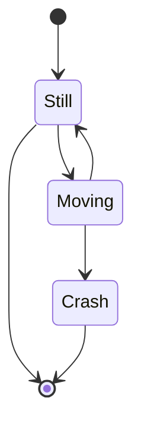
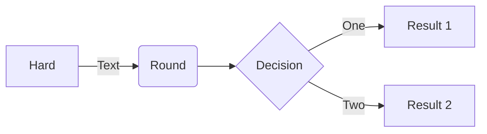
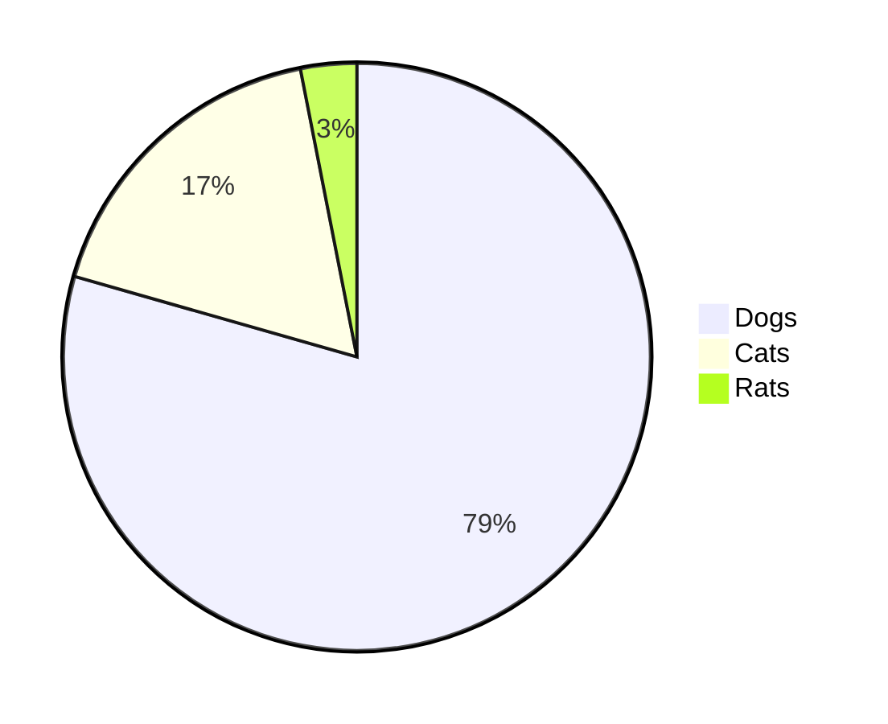
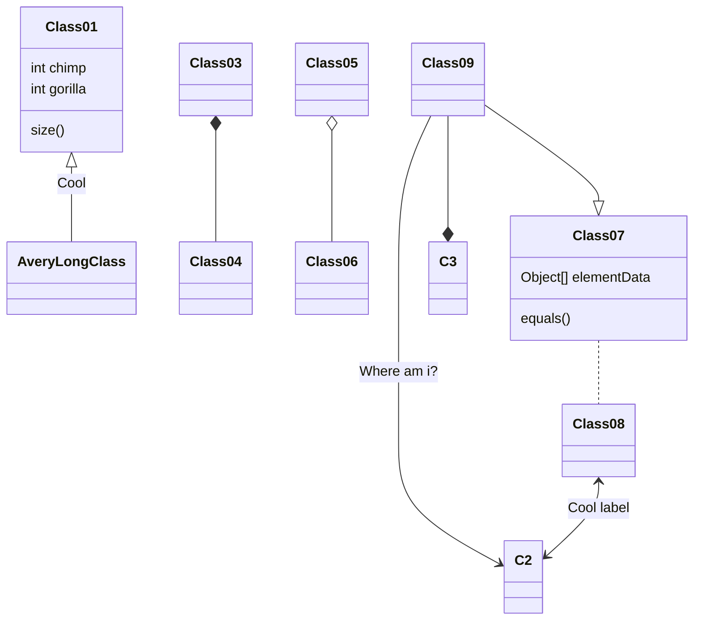
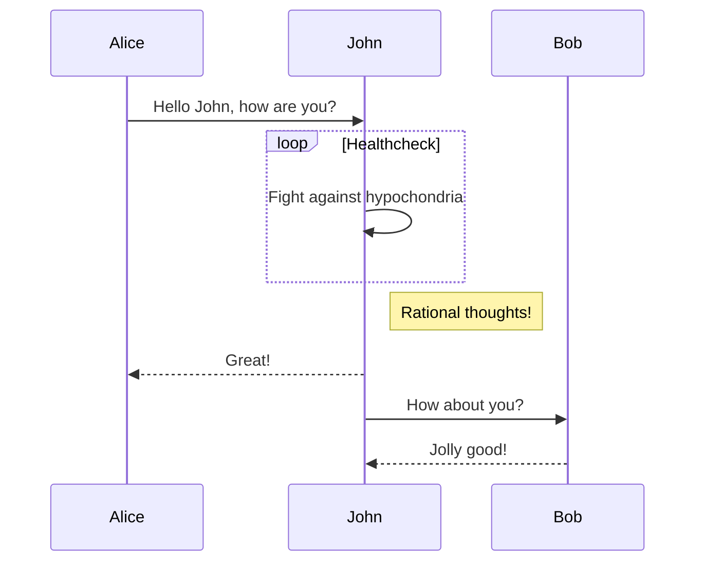
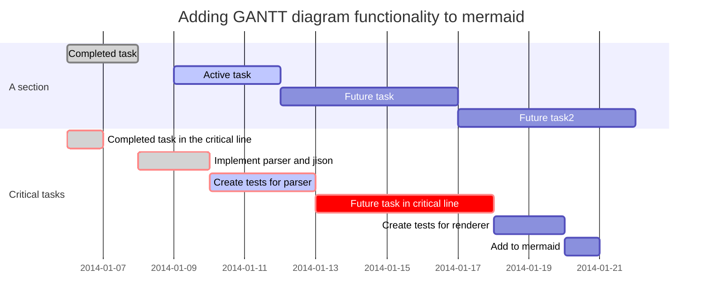
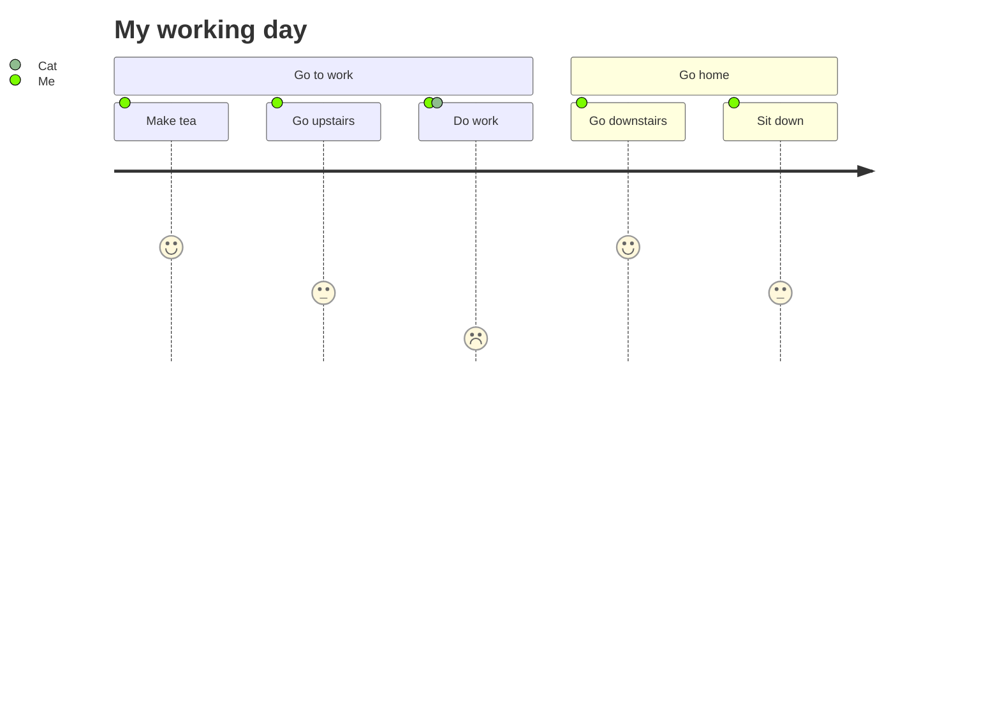

+++
title = 'elements'
date = '2023-01-03'
lastmod = ""
weight = 0
draft = false
+++

blog-vue

[](https://github.com/cellargalaxy/blog-vue)
[](https://github.com/cellargalaxy/blog-vue)
[](https://github.com/cellargalaxy/blog-vue)
[](https://github.com/cellargalaxy/blog-vue)

<!--more-->

## base

# Heading 1

## Heading 2

### Heading 3

#### Heading 4

##### Heading 5

###### Heading 6

---

~~Strikethrough~~

*This is italic text*

_This is italic text_

**This is bold text**

__This is bold text__

***This is bold italic text***

___This is bold italic text___

1. ol-1
1. ol-2
    1. ol-2-1
    1. ol-2-2

- ul-1
- ul-2
    - ul-2-1
    - ul-2-2

+ [X] checkbox-ul-1
+ [ ] checkbox-ul-2
    + [X] checkbox-ul-1-1
    + [ ] checkbox-ul-2-2

|           | big_table | big_table | big_table | big_table | big_table | big_table | big_table | big_table | big_table | big_table | big_table | big_table |
|-----------|-----------|-----------|-----------|-----------|-----------|-----------|-----------|-----------|-----------|-----------|-----------|-----------|
| big_table | big_table | big_table | big_table | big_table | big_table | big_table | big_table | big_table | big_table | big_table | big_table | big_table |
| big_table | big_table | big_table | big_table | big_table | big_table | big_table | big_table | big_table | big_table | big_table | big_table | big_table |
| big_table | big_table | big_table | big_table | big_table | big_table | big_table | big_table | big_table | big_table | big_table | big_table | big_table |
| big_table | big_table | big_table | big_table | big_table | big_table | big_table | big_table | big_table | big_table | big_table | big_table | big_table |
| big_table | big_table | big_table | big_table | big_table | big_table | big_table | big_table | big_table | big_table | big_table | big_table | big_table |
| big_table | big_table | big_table | big_table | big_table | big_table | big_table | big_table | big_table | big_table | big_table | big_table | big_table |
| big_table | big_table | big_table | big_table | big_table | big_table | big_table | big_table | big_table | big_table | big_table | big_table | big_table |
| big_table | big_table | big_table | big_table | big_table | big_table | big_table | big_table | big_table | big_table | big_table | big_table | big_table |
| big_table | big_table | big_table | big_table | big_table | big_table | big_table | big_table | big_table | big_table | big_table | big_table | big_table |
| big_table | big_table | big_table | big_table | big_table | big_table | big_table | big_table | big_table | big_table | big_table | big_table | big_table |
| big_table | big_table | big_table | big_table | big_table | big_table | big_table | big_table | big_table | big_table | big_table | big_table | big_table |
| big_table | big_table | big_table | big_table | big_table | big_table | big_table | big_table | big_table | big_table | big_table | big_table | big_table |
| big_table | big_table | big_table | big_table | big_table | big_table | big_table | big_table | big_table | big_table | big_table | big_table | big_table |
| big_table | big_table | big_table | big_table | big_table | big_table | big_table | big_table | big_table | big_table | big_table | big_table | big_table |
| big_table | big_table | big_table | big_table | big_table | big_table | big_table | big_table | big_table | big_table | big_table | big_table | big_table |
| big_table | big_table | big_table | big_table | big_table | big_table | big_table | big_table | big_table | big_table | big_table | big_table | big_table |
| big_table | big_table | big_table | big_table | big_table | big_table | big_table | big_table | big_table | big_table | big_table | big_table | big_table |
| big_table | big_table | big_table | big_table | big_table | big_table | big_table | big_table | big_table | big_table | big_table | big_table | big_table |
| big_table | big_table | big_table | big_table | big_table | big_table | big_table | big_table | big_table | big_table | big_table | big_table | big_table |
| big_table | big_table | big_table | big_table | big_table | big_table | big_table | big_table | big_table | big_table | big_table | big_table | big_table |
| big_table | big_table | big_table | big_table | big_table | big_table | big_table | big_table | big_table | big_table | big_table | big_table | big_table |
| big_table | big_table | big_table | big_table | big_table | big_table | big_table | big_table | big_table | big_table | big_table | big_table | big_table |
| big_table | big_table | big_table | big_table | big_table | big_table | big_table | big_table | big_table | big_table | big_table | big_table | big_table |
| big_table | big_table | big_table | big_table | big_table | big_table | big_table | big_table | big_table | big_table | big_table | big_table | big_table |
| big_table | big_table | big_table | big_table | big_table | big_table | big_table | big_table | big_table | big_table | big_table | big_table | big_table |
| big_table | big_table | big_table | big_table | big_table | big_table | big_table | big_table | big_table | big_table | big_table | big_table | big_table |
| big_table | big_table | big_table | big_table | big_table | big_table | big_table | big_table | big_table | big_table | big_table | big_table | big_table |
| big_table | big_table | big_table | big_table | big_table | big_table | big_table | big_table | big_table | big_table | big_table | big_table | big_table |
| big_table | big_table | big_table | big_table | big_table | big_table | big_table | big_table | big_table | big_table | big_table | big_table | big_table |
| big_table | big_table | big_table | big_table | big_table | big_table | big_table | big_table | big_table | big_table | big_table | big_table | big_table |
| big_table | big_table | big_table | big_table | big_table | big_table | big_table | big_table | big_table | big_table | big_table | big_table | big_table |
| big_table | big_table | big_table | big_table | big_table | big_table | big_table | big_table | big_table | big_table | big_table | big_table | big_table |

> Blockquotes can also be nested
>> by using additional greater-than signs right next to each other
>>> or with spaces between arrows.

## code

Excuting an order:`npm install marked`,Likely to succeed.

```javascript
function test() {
    console.log("Hello world!");
}

var testBox = box();
testBox.add("jQuery").remove("jQuery");
```

```html
<!DOCTYPE html>
<html>
<head>
    <mate charest="utf-8"/>
    <title>Hello world!</title>
</head>
<body>
<h1>Hello world!</h1>
</body>
</html>
```

```shell
ls /
cat /proc/mounts
cat /proc/1/maps
apt-get update
apt-get install tcpdump
tcpdump
apt-get install lsof
lsof
```

```css
body {
    background-color: burlywood;
}

.black-background-5 {
    background-color: rgba(0, 0, 0, 0.5);
    border-color: rgba(0, 0, 0, 0.5);
}
```

```go
func main(){
    fmt.Println("go")
}
```

```java
public void main(String[] args){
    System.out.println("Hello World");
}
```

```json
{
  "url": "https://i.loli.net/2018/08/21/5b7bb5dd4f0df.png",
  "description": "wide image",
  "type": "wide"
}
```

```markdown
# Heading 1

[普通链接带标题](http://localhost/ "普通链接带标题")

执行命令：`npm install marked`
```

```sql
SELECT COUNT(*) AS cpt, MAX(t.pos) AS max_pos
FROM `my_table`
LEFT JOIN `other_table` AS t
WHERE `somecol` IS NOT NULL
ORDER BY t.other_col DESC
```

```yaml
product: High Heeled "Ruby" Slippers
description: "Putting on these \"slippers\" is easy."
address:
  city: East Centerville
  street: !!str |
    123 Tornado Alley
    Suite 16
```

## mermaid

```goat
      .               .                .               .--- 1          .-- 1     / 1
     / \              |                |           .---+            .-+         +
    /   \         .---+---.         .--+--.        |   '--- 2      |   '-- 2   / \ 2
   +     +        |       |        |       |    ---+            ---+          +
  / \   / \     .-+-.   .-+-.     .+.     .+.      |   .--- 3      |   .-- 3   \ / 3
 /   \ /   \    |   |   |   |    |   |   |   |     '---+            '-+         +
 1   2 3   4    1   2   3   4    1   2   3   4         '--- 4          '-- 4     \ 4

```
















## katex

https://tiddlywiki.com/plugins/tiddlywiki/katex/

Lift($L$) can be determined by Lift Coefficient ($C_L$) like the following equation.

$$
L = \frac{1}{2} \rho v^2 S C_L
$$

$$0.414213562373095048\approx6\*16^{-1}+a\*16^{-2}+0\*16^{-3}+\cdots$$

$$
{CO2 + C -> 2 CO}
$$

$$
\frac{1}{\Bigl(\sqrt{\phi \sqrt{5}}-\phi\Bigr) e^{\frac25 \pi}} = 1+\frac{e^{-2\pi}} {1+\frac{e^{-4\pi}}
{1+\frac{e^{-6\pi}} {1+\frac{e^{-8\pi}} {1+\cdots} } } }
$$

$$
1 + \frac{q^2}{(1-q)}+\frac{q^6}{(1-q)(1-q^2)}+\cdots = \prod_{j=0}^{\infty}\frac{1}{(1-q^{5j+2})(1-q^{5j+3})},
\quad\quad \text{for }\lvert q\rvert<1.
$$

## picture


## youtube

<iframe style="height:500px;width:100%;" src="https://www.youtube.com/embed/Yh2xKRJGff4?si=GRg3ipZU56-Nfphm"></iframe>

## tradingview

<script type="text/javascript" src="https://s3.tradingview.com/tv.js"></script>
<script type="text/javascript">
    new TradingView.widget(
            {
                "height": "500px",
                "width": "100%",
                "symbol": "NASDAQ:AAPL",
                "interval": "D",
                "theme": "dark"
            }
    )
</script>
