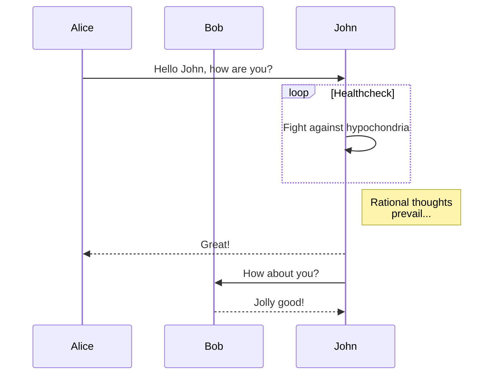
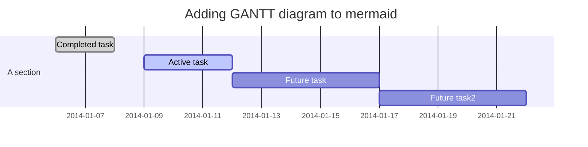
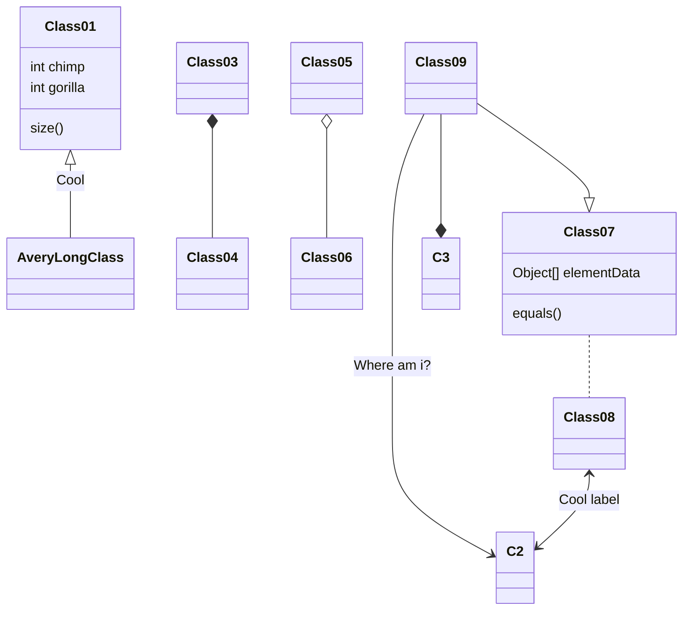

> 欢迎体验 [Fluid](https://github.com/fluid-dev/hexo-theme-fluid) ，这是一款 Material Design 风格的 Hexo
> 主题，以简约的设计帮助你专注于写作，本篇文章可预览主题的样式及功能。

   

<!-- more -->

# Heading 1

## Heading 2

### Heading 3

#### Heading 4

##### Heading 5

###### Heading 6

文章大部分使用的是 github-markdown 样式，并加入了一些 Material 风格。
上标：X<sub>2</sub>，下标：O<sup>2</sup>

> 引用：如果想要插入空白换行`即<br />标签`
> ，在插入处先键入两个以上的空格然后回车即可，[普通链接带标题](http://localhost/ "普通链接带标题")。
>

## 表格

| Left |  Center   |                   Right |
|:-----|:---------:|------------------------:|
| 删除线  |  ~~删除线~~  | <s>删除线（开启识别HTML标签时）</s> |
| 斜体字  |   *斜体字*   |                   _斜体字_ |
| 粗体   |  **粗体**   |                  __粗体__ |
| 粗斜体  | ***粗斜体*** |               ___粗斜体___ |

## 列表

### 有序列表

Fluid 相较于其他主题的优势：

1. 设计遵循简洁至上，同时具有轻快的体验，和优雅的颜值；
2. 提供大量定制化配置项，使每个用户使用该主题都能具有独特的样式；
3. 响应式页面，适配手机、平板等设备；

### 无序列表

Fluid 功能特性：

- 无比详实的[用户文档](https://hexo.fluid-dev.com/docs/)
- 页面组件懒加载
- 多种代码高亮方案
- 多语言配置
- 内置多款评论插件
- 内置网页访问统计
- 内置文章本地搜索
- 支持暗色模式
- 支持脚注语法
- 支持 LaTeX 数学公式
- 支持 mermaid 流程图

+ [X]  列表一
+ [ ]  列表二

## 代码

执行命令：`npm install marked`

```javascript
function test() {
    console.log("Hello world!");
}

var testBox = box();
testBox.add("jQuery").remove("jQuery");
```

```html
<!DOCTYPE html>
<html>
<head>
    <mate charest="utf-8"/>
    <title>Hello world!</title>
</head>
<body>
<h1>Hello world!</h1>
</body>
</html>
```

```shell
ls /
cat /proc/mounts
cat /proc/1/maps
apt-get update
apt-get install tcpdump
tcpdump
apt-get install lsof
lsof
```

```css
body {
    background-color: burlywood;
}

.black-background-5 {
    background-color: rgba(0, 0, 0, 0.5);
    border-color: rgba(0, 0, 0, 0.5);
}
```

```go
func main(){
    fmt.Println("go")
}
```

```java
public void main(String[] args){
    System.out.println("Hello World");
}
```

```json
{
  "url": "https://i.loli.net/2018/08/21/5b7bb5dd4f0df.png",
  "description": "wide image",
  "type": "wide"
}
```

```markdown
# Heading 1

[普通链接带标题](http://localhost/ "普通链接带标题")

执行命令：`npm install marked`
```

```sql
SELECT COUNT(*) AS cpt, MAX(t.pos) AS max_pos
FROM `my_table`
LEFT JOIN `other_table` AS t
WHERE `somecol` IS NOT NULL
ORDER BY t.other_col DESC
```

```yaml
product: High Heeled "Ruby" Slippers
description: "Putting on these \"slippers\" is easy."
address:
  city: East Centerville
  street: !!str |
    123 Tornado Alley
    Suite 16
```

## 图片

![svg](data:image/svg+xml;base64,PD94bWwgdmVyc2lvbj0iMS4wIiBlbmNvZGluZz0idXRmLTgiPz48c3ZnIHZlcnNpb249IjEuMSIgeG1sbnM9Imh0dHA6Ly93d3cudzMub3JnLzIwMDAvc3ZnIiB4bWxuczp4bGluaz0iaHR0cDovL3d3dy53My5vcmcvMTk5OS94bGluayIgeD0iMHB4IiB5PSIwcHgiCgkgdmlld0JveD0iMCAwIDUwMCA1MDAiIHN0eWxlPSJlbmFibGUtYmFja2dyb3VuZDpuZXcgMCAwIDUwMCA1MDA7IiB4bWw6c3BhY2U9InByZXNlcnZlIj48ZyBpZD0iQkFDS0dST1VORCI+PHJlY3Qgc3R5bGU9ImZpbGw6I0ZGRkZGRjsiIHdpZHRoPSI1MDAiIGhlaWdodD0iNTAwIi8+PC9nPjxnIGlkPSJPQkpFQ1RTIj48cGF0aCBzdHlsZT0iZmlsbDojRTdBRTVFOyIgZD0iTTE1NC44NTIsMTI3YzIuMTA3LDE0LjM5LDEzLjE3OSwxNS4yODIsMTMuMTc5LDE1LjI4MmMtMTAuMjEyLDEuOTg4LTEyLjAzMywxNC42NTEtMTIuMDMzLDE0LjY1MQoJCXMtMi43ODQtMTIuNDg3LTEzLjExOC0xMy42ODhDMTQyLjg4MSwxNDMuMjQ1LDE1My44MjgsMTQxLjkzOCwxNTQuODUyLDEyN3oiLz48cGF0aCBzdHlsZT0iZmlsbDojRTdBRTVFOyIgZD0iTTM0MC43NCwxNjEuNzc5YzIuMTA3LDE0LjM5LDEzLjE3OSwxNS4yODIsMTMuMTc5LDE1LjI4MgoJCWMtMTAuMjEyLDEuOTg3LTEyLjAzMywxNC42NTEtMTIuMDMzLDE0LjY1MXMtMi43ODQtMTIuNDg3LTEzLjExOC0xMy42ODhDMzI4Ljc2OSwxNzguMDIzLDMzOS43MTYsMTc2LjcxNywzNDAuNzQsMTYxLjc3OXoiLz48Zz48cGF0aCBzdHlsZT0iZmlsbDojMTUyMzQ1OyIgZD0iTTIxNS4zNTEsMjExLjU0NmMwLjEyNSwwLjcxNiwwLjI3OCwxLjQ4NSwwLjc3NiwyLjI3NmMwLjQ2MSwwLjc3MiwxLjI0NywxLjQ3OSwyLjA4MSwxLjgxNQoJCQljMS42NzUsMC42NiwzLjA3OSwwLjQ1OCw0LjI1NCwwLjI0NWMxLjE5MS0wLjIzOSwyLjIzNS0wLjYwMSwzLjIwNC0wLjk4NGMxLjkyOC0wLjc3NywzLjU1LTEuNjUsNC45MDMtMi40MjUKCQkJYzEuMjU4LTAuNzIzLDIuMjU5LTEuMzYzLDIuOTkzLTEuODQ1YzAuNjQ1LDAuNTk2LDEuNTI4LDEuMzkxLDIuNjUsMi4zMWMxLjIwOCwwLjk4NiwyLjY2NSwyLjExMyw0LjQzOSwzLjE5NQoJCQljMC44OTMsMC41MzcsMS44NjMsMS4wNjUsMi45OTksMS40OTZjMS4xMjQsMC40MDIsMi40NzYsMC44MzEsNC4yMzYsMC40NTRjMC44NzctMC4xOTUsMS43NjktMC43NjMsMi4zNS0xLjQ1CgkJCWMwLjYyLTAuNjk5LDAuODk3LTEuNDMzLDEuMTM4LTIuMTE4YzAuNDA0LTEuMzY0LDAuNDY0LTIuNjA3LDAuNDUyLTMuNzk3Yy0wLjA1NS0yLjM2OS0wLjQ5Ny00LjUyMS0xLjAxMy02LjQ1OQoJCQljLTEuMDY5LTMuODYyLTIuNTgxLTYuOC0zLjQyOS04LjIxOWMtMS41NDgtMi42MjYtMy4yODUtNC40NTEtNS4yNjctNS43MWMtMS45NTMtMS4yNS00LjI5OC0xLjkzOS02Ljc1My0xLjU4NwoJCQljMS4xNiwwLjQzOCwyLjA2MywxLjA0MywyLjg0MywxLjY4MWMwLjc4MywwLjYzMywxLjQzMiwxLjM0NSwyLjA1OSwyLjA4OWMxLjI0MywxLjQ5NSwyLjQxMiwzLjE3NSwzLjc0Myw1LjQ4MwoJCQljMC43MjMsMS4yMzUsMi4wNjYsMy44NjYsMy4wMTQsNy4yOThjMC40NTcsMS43MDYsMC44MzQsMy42MjEsMC44NzQsNS40OTVjMC4wMTcsMC45MjQtMC4wNjIsMS44NTMtMC4yNzMsMi41NTcKCQkJYy0wLjExNywwLjMyLTAuMjM5LDAuNjE4LTAuMzU1LDAuNzE1Yy0wLjExOCwwLjExOC0wLjE2MiwwLjE3MS0wLjMzMSwwLjIxMmMtMC4zNDEsMC4wOTQtMS4xMzYtMC4wMDUtMS45MTYtMC4zMTkKCQkJYy0wLjc4OC0wLjI5Ni0xLjU5MS0wLjcyLTIuMzQ3LTEuMTc2Yy0xLjUxNy0wLjkyLTIuODcxLTEuOTU2LTMuOTg5LTIuODY4Yy0xLjEyLTAuOTE0LTIuMDExLTEuNzE4LTIuNjE5LTIuMjgxCgkJCWMtMC41ODktMC41NjEtMC45MjEtMC44NzgtMC45MjEtMC44NzhsLTIuNTE1LTAuMjA3bC0wLjAwMSwwbC0wLjAwMywwLjAwMmMwLDAtMC4wMDYsMC4wMDQtMC4wMTEsMC4wMDcKCQkJYy0wLjAxMSwwLjAwOC0wLjAyNiwwLjAxOS0wLjA0NywwLjAzM2MtMC4wNDUsMC4wMzEtMC4xMTIsMC4wNzgtMC4yLDAuMTM5Yy0wLjE4MiwwLjEyMi0wLjQ0OSwwLjMwMy0wLjc5MiwwLjUzMwoJCQljLTAuNjkyLDAuNDU2LTEuNzAyLDEuMTA0LTIuOTU3LDEuODIyYy0xLjI1MiwwLjcxNy0yLjc1NywxLjUxNy00LjQwNSwyLjE3NmMtMC44MiwwLjMyNi0xLjY4MiwwLjYxMy0yLjUwOCwwLjc3NgoJCQljLTAuODIxLDAuMTgzLTEuNjIxLDAuMTUtMS45NDIsMC4wMDFjLTAuMTYtMC4wNjgtMC4xOTQtMC4xMjctMC4yOTItMC4yNjRjLTAuMDk5LTAuMTE0LTAuMTctMC40MjgtMC4yMzMtMC43NjQKCQkJYy0wLjA5My0wLjcyOS0wLjAxOS0xLjY1OCwwLjE0OS0yLjU2N2MwLjM0Ny0xLjg0MiwxLjAzMi0zLjY3MSwxLjc2Mi01LjI3OGMxLjQ5Ny0zLjIzMSwzLjI1My01LjYwNyw0LjE2OS02LjcwNwoJCQljMS42OTEtMi4wNTksMy4xMTktMy41MjUsNC41OS00Ljc5NmMwLjc0LTAuNjMxLDEuNDk3LTEuMjI3LDIuMzczLTEuNzIzYzAuODc0LTAuNTAyLDEuODYzLTAuOTUxLDMuMDgtMS4xOTMKCQkJYy0yLjM2NC0wLjc0OC00Ljc5LTAuNDUzLTYuOTIyLDAuNDYxYy0yLjE2MSwwLjkxNy00LjE3NCwyLjQzMy02LjEzLDQuNzdjLTEuMDY5LDEuMjYxLTMuMDQxLDMuOTEyLTQuNzI4LDcuNTQ3CgkJCWMtMC44MjcsMS44MjctMS42MTUsMy44NzgtMi4wNTcsNi4yMDZDMjE1LjMyMSwyMDguODk4LDIxNS4xNzYsMjEwLjEzNCwyMTUuMzUxLDIxMS41NDZ6Ii8+PHBhdGggc3R5bGU9ImZpbGw6IzE1MjM0NTsiIGQ9Ik00NDYuNzU1LDE4Ny4wNjFjLTIuNjc0LTExLjIxNy02LjY4OC0yMi4xMTYtMTEuODg5LTMyLjQwNwoJCQljLTUuNDM1LTEwLjc1My0xMi4yMTMtMjAuODA1LTIwLjAzNS0yOS45NjZjLTguNjEtMTAuMDg0LTE4LjUxOC0xOS4zNDMtMjkuNTM4LTI2Ljc0OWMtMC43NTctMC41MDktMS41MTgtMS4wMTUtMi4zMDItMS40ODEKCQkJYy0xLjQ5My0wLjg4Ni0zLjA1NCwwLjU3LTIuNzU0LDIuMTE3YzMuMTE5LDE2LjA3OSwzLjI1NywzMi43ODktMS4wNjIsNDguNjYyYy0zLjUwNiwxMi44ODUtOS44NTgsMjQuODg5LTE4LjI5MiwzNS4yMjYKCQkJYy03LjQ1NCw5LjEzNS0xNi4zNDksMTcuMDI2LTI1Ljk5NiwyMy42NjFjLTcuNTQsNS4xODYtMTUuNTYsOS42ODQtMjMuODk1LDEzLjQ2Yy0wLjc3LDAuMzQ5LTEuNTQ0LDAuNjkyLTIuMzIsMS4wMjcKCQkJYy0wLjMxMSwwLjEzNS0wLjYyMywwLjI2OC0wLjkzNSwwLjRjLTAuMTEsMC4wNDYtMC4zMDEsMC4xMjctMC4zNTMsMC4xNDhjLTAuMTgzLDAuMDc2LTAuMzY1LDAuMTUyLTAuNTQ4LDAuMjI3CgkJCWMtMS4xODUsMC40ODktMi4zNzcsMC45NjEtMy41NzcsMS40MTRjLTEuMjc5LDAuNDgzLTIuNTc1LDAuOTA3LTMuODYyLDEuMzY1Yy0wLjAzNSwwLjAxMi0wLjA3LDAuMDIzLTAuMTA2LDAuMDMzCgkJCWMtMC44OTItMC45NzUtMS44MTgtMS45MzUtMi43ODgtMi44NDNjMC41ODctMC41NzQsMS4xNjQtMS4xNTcsMS43MjQtMS43NThjNi43MzctNy4yMjMsMTEuNDAxLTE2LjYyOSwxMS4wODgtMjYuNjc4CgkJCWMtMC4xNC00LjQ5LTEuMjI3LTguODE5LTMtMTIuODcxYzEuNTc4LTAuMTE5LDMuMDk1LTAuMzY2LDQuNTU2LTAuODAxYzIuMTE2LTAuNjIxLDQuMTIzLTEuNjcxLDUuODQ1LTMuMjM4CgkJCWMxLjc0Mi0xLjU0OSwzLjA5NS0zLjY1MiwzLjk3NS02LjA3N2MwLjg1OS0yLjQzNiwxLjI0OS01LjE3NCwxLjIyMi04LjE1MmMtMC4wMDQtMS40ODItMC4xNC0zLjYyMy0wLjQ5LTYuMTQ3CgkJCWMtMC4zNDMtMi41MTktMC45MzMtNS40MzMtMS41NTctOC40NDNjLTAuNTcxLTIuODg0LTAuODQ1LTYuMDM2LTAuNjg4LTkuMTYzYzAuMDY0LTEuNTYzLDAuMjQyLTMuMTE5LDAuNTAyLTQuNjIzCgkJCWMwLjI0OS0xLjQ1NiwwLjYxNC0yLjk2OCwxLjAxOS00LjE1OGMyLjU4OS00Ljk4LDQuMjU5LTEwLjI0Nyw0LjY1NC0xNS4yMTZjMC4yMjYtMi41MDMsMC4xOTItNC45MTQtMC4wODctNy4xMzgKCQkJYy0wLjIzLTIuMjMyLTAuNzA3LTQuMjczLTEuMjI3LTYuMTAxYy0xLjA4LTMuNjUyLTIuNDQ3LTYuNDItMy40NTQtOC4yNzVjLTAuNTAxLTAuOTMyLTAuOTI4LTEuNjMzLTEuMjIzLTIuMTA1CgkJCWMtMC4yOTEtMC40NzQtMC40NDQtMC43MjQtMC40NDQtMC43MjRzLTAuMTE3LTAuMTc2LTAuNDE2LTAuNjI1Yy0wLjI5NC0wLjQ1My0wLjc3OC0xLjE3My0xLjU1NS0yLjIyNwoJCQljLTAuNzg4LTEuMDQ1LTEuODUtMi40NDItMy40MDMtNC4xNTJjLTAuNzg0LTAuODQ3LTEuNjY1LTEuNzk1LTIuNzE3LTIuNzk0Yy0xLjA2NS0xLjAxMi0yLjIwMi0yLjA1Ny0zLjcxMi0zLjIxMmwtMi44OTEtMi4yMQoJCQlsLTAuMjE3LDMuN2MtMC4xMjEsMi4wNi0wLjQ5OCw1LjkxOS0xLjc2NSwxMC41OTJjLTEuMjA4LDQuNjgtMy4zMTYsMTAuMTEtNS43ODgsMTUuNDA4CgkJCWMtNC45NjYsMTAuNjEzLTExLjUyMSwyMC41NzItMTQuMTI1LDI0LjQzNWMtMy4xMjYsNC42NDktNS41NjgsOC4zMDQtNy44MjEsMTEuODNjLTEuOTA5LDMuMDMzLTMuNzUxLDUuOTU5LTUuODUzLDkuMwoJCQljLTEyLjY4Mi0zLjY2OC0yNi40NjEtMy44MDktMzkuMTQyLTAuMzg3Yy0xLjkwMi0zLjQ1Ny0zLjU2OS02LjQ4NS01LjI5Ni05LjYyM2MtMi4wNDItMy42NTEtNC4yNjYtNy40NDMtNy4xMTUtMTIuMjY3CgkJCWMtMi4zNzItNC4wMDktOC4zMzQtMTQuMzM1LTEyLjY2OS0yNS4yMmMtMi4xNTgtNS40MzMtMy45NDMtMTAuOTc4LTQuODc2LTE1LjcyMWMtMC45OTEtNC43NC0xLjE0Mi04LjYxNC0xLjE0MS0xMC42NzhsMC0zLjcwNgoJCQlsLTMuMDE1LDIuMDM3Yy0xLjU3NSwxLjA2NC0yLjc3MSwyLjA0MS0zLjg5NCwyLjk4OWMtMS4xMDksMC45MzUtMi4wNDQsMS44My0yLjg3NiwyLjYyOWMtMS42NSwxLjYxNi0yLjc5MywyLjk0OC0zLjY0LDMuOTQ1CgkJCWMtMC44MzgsMS4wMDctMS4zNjMsMS42OTctMS42ODMsMi4xMzJjLTAuMzI1LDAuNDMxLTAuNDUyLDAuNi0wLjQ1MiwwLjZzLTAuMTY3LDAuMjQtMC40ODYsMC42OTYKCQkJYy0wLjMyMiwwLjQ1My0wLjc4OSwxLjEyOC0xLjM0NCwyLjAyOWMtMS4xMTQsMS43OTMtMi42NCw0LjQ3NS0zLjkzMyw4LjA1OGMtMC42MjYsMS43OTQtMS4yMjEsMy44MDMtMS41ODIsNi4wMTgKCQkJYy0wLjQwOCwyLjIwNC0wLjU4Myw0LjYwOS0wLjUwNSw3LjEyMWMwLjEwNCw0Ljk4NCwxLjQ2MywxMC4zMzksMy43NTUsMTUuNDYzYzAuMzM1LDEuMjEyLDAuNjExLDIuNzQyLDAuNzc0LDQuMjEKCQkJYzAuMTcyLDEuNTE3LDAuMjU4LDMuMDgsMC4yMyw0LjY0NGMtMC4wMjcsMy4xMzEtMC40ODUsNi4yNjEtMS4yMjQsOS4xMDdjLTAuOCwyLjk2OS0xLjU1OSw1Ljg0My0yLjA0OSw4LjMzOAoJCQljLTAuNDk3LDIuNDk5LTAuNzU5LDQuNjI4LTAuODQ5LDYuMTA3Yy0wLjIwMiwyLjk3MiwwLjAyNyw1LjcyOCwwLjc0Miw4LjIxYzAuNzM2LDIuNDczLDEuOTY0LDQuNjUxLDMuNjEyLDYuMwoJCQljMS42MjcsMS42NjYsMy41NjksMi44MzEsNS42NDYsMy41NzVjMS40NTcsMC41MjgsMi45ODMsMC44NjgsNC41OCwxLjA3OGMtMy4zODMsNS40NDYtNS43NTEsMTEuNDktNi41MTgsMTcuOTA1CgkJCWMtMC4yNjIsMi4xOTEtMC4zLDQuMzk5LTAuMTE3LDYuNTk4YzAuNjI2LDYuNzYsMy4xNDYsMTIuNjA3LDYuODk4LDE3LjU3OWMtMS4zNDgsMS44NzEtMi41OCwzLjgzMi0zLjY0NCw1Ljg3MQoJCQljLTEyLjkwMi03LjQ1LTI0Ljg4NS0xNi42MDEtMzQuOTQ2LTI3LjYxN2MtMTMuNjg2LTE0Ljk4NS0yMy4zMjYtMzMuNTk3LTI1Ljg0Mi01My44NzJjLTEuNzg3LTE0LjM5OC0wLjE2Ni0yOC45MzUsMy42OTEtNDIuODcxCgkJCWMwLjQ2LTEuNjY0LTEuMzMxLTIuODE3LTIuNzU0LTIuMTE3Yy0zLjIyOSwxLjU4Ni02LjMwMywzLjU0OS05LjMsNS41MjljLTYuMzcyLDQuMjA4LTEyLjQzLDguOTE3LTE4LjEzLDEzLjk5NwoJCQljLTkuMDg5LDguMTAyLTE3LjIxOSwxNy4yNzEtMjQuMTQ2LDI3LjI4NmMtNi41OTQsOS41MzUtMTIuMDE5LDE5Ljg0My0xNi4yMTIsMzAuNjQ4Yy00LjA3OSwxMC41MDktNi45MzEsMjEuNDg5LTguNTEsMzIuNjUKCQkJYy0xLjU2NCwxMS4wNTUtMS45NTIsMjIuMjUtMS4wODIsMzMuMzg0YzAuODcyLDExLjE0NSwyLjkyOSwyMi4yMDQsNi4xNzIsMzIuOTAzYzMuMjM3LDEwLjY4Miw3LjYzOCwyMS4wMzQsMTMuMTA2LDMwLjc2NgoJCQljNS41NjEsOS44OTksMTIuMjU0LDE5LjE3NSwxOS44ODksMjcuNTc4YzcuODEsOC41OTYsMTYuNjQzLDE2LjI1MiwyNi4yMjIsMjIuODE1YzEwLjExMyw2LjkyOSwyMS4wNzMsMTIuNTY5LDMyLjUyNSwxNi45MwoJCQljMy4xOTQsMS4yMTYsNi40MjcsMi4zMTksOS42ODcsMy4zNDZjMS45MzgsMC42MSwyLjkyMy0xLjc5NywxLjgyNC0zLjEzNGMtOS42NDQtMTEuNzQtMTguODY2LTIzLjk5NC0yNi45OTMtMzYuODMzCgkJCWMtMi42MDItNC4xMS01LjA5MS04LjMyMi03LjE1Ni0xMi43MzNjMC4wMy0wLjA2OSwwLjA2LTAuMTM5LDAuMDktMC4yMDhjMC40NTQtMS4wMjUsMC45NDctMi4wMzMsMS40NjktMy4wMjUKCQkJYzEuNi0zLjAzOSwzLjUxNS01Ljk4Nyw1LjU4OS04LjM5M2MyLjU1My0yLjk2Miw1LjYwNy01LjU5OCw5LjA0My02LjkzMmM0LjE4My0xLjYyNCw4LjQ2NC0xLjQyMSwxMi42OTIsMC4zMjMKCQkJYzcuOTI0LDMuMjY4LDE0LjA4OSwxMC4zODcsMTkuMTA5LDE3LjA2NmMwLjg0NiwxLjEyNSwzLjEyNiwxLjMyNSwzLjQyNy0wLjQ0OGMwLjQ0NS0yLjYyMiwxLjQzNi01LjUxMywyLjQxOC03LjYyNQoJCQljMi4wMTQtNC4zMzQsNS4wNDYtOC4zNjYsOS44LTkuNDgyYzMuMjY4LTAuNzY3LDYuNzY0LDAuMTI4LDkuODI0LDEuNWMwLjAwMSwwLjAwNywwLjAwMSwwLjAxMywwLjAwMSwwLjAyCgkJCWMwLjI0NSwzLjI4NiwwLjY5LDYuNjUxLDEuMzY3LDkuODkxYzEuMzA0LDYuNDk2LDMuNDE1LDEyLjQ3NSw1LjI2NiwxNi43NGMwLjQ0MSwxLjA3NywwLjg5NCwyLjAzNiwxLjMwMSwyLjg3OQoJCQljMC40MDQsMC44NDQsMC43MzgsMS41ODQsMS4wNTcsMi4xN2MwLjYxNiwxLjE4MiwwLjk2MiwxLjg0OCwwLjk2MiwxLjg0OHMwLjIzMiwwLjQ1MiwxLjA5LDEuOTYxCgkJCWMwLjQxNSwwLjc2MiwxLjAzMiwxLjc2NSwxLjg1NSwzLjEwN2MwLjYzMywwLjk3NiwxLjM1MywyLjEwNCwyLjMxMiwzLjQzM2MtMC4zMjcsMC4yMjctMC42OCwwLjQ2Ni0xLjA3NywwLjcyOQoJCQljLTEuMTgzLDAuNzc4LTIuNjU0LDEuNjk0LTQuMzExLDIuNjk1Yy0wLjgzMiwwLjQ5OC0xLjcwNywxLjAyLTIuNjE1LDEuNTYzYy0wLjkxNCwwLjU0LTEuODY0LDEuMTA2LTIuODAzLDEuNTk4CgkJCWMtMS44NzksMS4wNDgtNC4wMDQsMS45NjUtNi4xMzYsMi44NjljLTguNjQ0LDMuNDg2LTE3Ljk3NSw1LjkxMy0yMS41MzUsNi44NTJjLTEuOTc5LDAuNTI5LTMuNzUxLDEuMDAzLTUuMzg2LDEuNDRsLTEuNDY3LDAuMzkyCgkJCWwwLjA0MiwxLjI4M2MwLjA1MiwxLjU4OCwwLjIxMywzLjEyOCwwLjg4OCw0LjQ5NmMwLjYxNywxLjM1NiwxLjUzMywyLjUzNiwyLjY1OSwzLjM0MmMxLjcwNCwxLjI1MSwzLjY0NSwxLjg4Miw1LjcwNCwyLjA1OAoJCQljMC4xNDMsMC45MywwLjQyNCwxLjg0NiwwLjgyMSwyLjcyOGMwLjk4MywyLjE3NiwyLjk5Niw0LjI0NCw1LjYzLDUuMDA5YzIuNjIyLDAuNzg2LDUuMzMsMC4yODQsNy41LTAuNjIyCgkJCWMyLjIxOC0wLjksNC4wNjktMi4xODksNS43MDgtMy40ODRjMC43Ni0wLjYxMSwxLjQ5OS0xLjIwNiwyLjIxMi0xLjc3OWMwLjcxNi0wLjUzNywxLjQtMS4wNiwyLjA2OS0xLjUzNgoJCQljMS4zNC0wLjk1MiwyLjU3Ni0xLjc2MywzLjYyMS0yLjQzMWMyLjEwMi0xLjMyLDMuNDMyLTIuMDY5LDMuNDMyLTIuMDY5czQuNzMtMi43ODIsMTEuMzIxLTUuNzQyCgkJCWMxLjY0Ni0wLjc0LDMuNDAxLTEuNTAxLDUuMjE0LTIuMjQzYzAuNDY0LTAuMTkxLDAuOTMyLTAuMzgzLDEuNDAxLTAuNTc1bDAuODE4LTAuMzc0bDAuNzg2LTAuNDQ1CgkJCWMxLjAyNi0wLjYzMywxLjk2Mi0xLjQyMSwyLjc2LTIuMzI4YzEuNjEzLTEuODA0LDIuNTk1LTQuMTI3LDIuODQ4LTYuNDUzYzAuMTQtMS4xNjQsMC4wNDktMi4zMjktMC4xNjgtMy40MjMKCQkJYy0wLjEwOS0wLjU1My0wLjI0NC0xLjA3NC0wLjQzMy0xLjU4NmMtMC4wOTItMC4yNTctMC4xOTMtMC41MTEtMC4zMDktMC43NjZjLTAuMTA0LTAuMjIxLTAuMTc5LTAuMzg3LTAuMzI0LTAuNjM4CgkJCWMtMi4yNDMtNS4zODEtMi4wMzctOS40MTQtMS44NDItMTEuMjgzYzAuMzg1LTMuMzk5LDEuMjUxLTYsMi4yMjUtOC40NjRjMC44OS0yLjE1MiwxLjg2MS00LjIzNywzLjM2Ni02LjQ1MwoJCQljMC4wODQtMC4wMDYsMC4xNzEtMC4wMiwwLjI1NS0wLjAyNWMyLjk1LTAuMTczLDUuNzg2LDAuMTM5LDguNDQ4LDEuMDY0YzUuMzE4LDEuODUzLDkuOTI0LDYuMDcxLDEzLjU5MywxMi45NTMKCQkJYzAuNzU0LDEuNDQ2LDEuNzU1LDMuNDkyLDIuNzA0LDYuMDkzYzAuOTUxLDIuNTk3LDEuODgxLDUuNzMzLDIuNTkxLDkuMjRjMC4zNTksMS43NTEsMC42NTQsMy42LDAuODUzLDUuNDkxCgkJCWMwLjA4MywwLjkzMywwLjE3MywxLjkxNSwwLjE2MywyLjc5N2MtMC4wMywwLjQzOC0wLjA2LDAuODc4LTAuMDksMS4zMmMtMC4wNzQsMC40Ny0wLjE0OCwwLjk0Mi0wLjIyMiwxLjQxNgoJCQljLTAuNzQ4LDMuODcxLTIuMDg0LDcuOTcyLTMuNDkxLDExLjk5Yy0wLjcxNCwyLjAxMy0xLjQ1NCw0LjAxOC0yLjIyLDUuOTljLTAuMzg4LDAuOTg0LTAuNzc1LDEuOTYyLTEuMTU4LDIuOTMyCgkJCWMtMC4xOTcsMC40ODItMC4zOTIsMC45NjEtMC41ODcsMS40MzlsLTAuMTQ2LDAuMzUyYy0wLjQ0My0xLjk3MSwwLjU5LDIuNzEsMC40OTYsMi4yMzVsMC4wMjQsMC4wMmwwLjA0OCwwLjAzOWwwLjA5NSwwLjA3OQoJCQlsMC4xOTEsMC4xNTZjMC4yNSwwLjIxNCwwLjUxMiwwLjQxMSwwLjc5MywwLjU4MmMyLjE5NywxLjQ1LDQuOTM1LDEuODU0LDcuMzQ0LDEuMjMyYzEuMjA3LTAuMzA1LDIuMzM4LTAuODYyLDMuMjkyLTEuNjA5CgkJCWMwLjk1MS0wLjcxNiwxLjc1NS0xLjc2NCwyLjIzNy0yLjUwN2MyLjExMi0zLjE4NCwzLjU3My02LjEwNyw0Ljg1OC04LjU4OWMwLjU4OS0xLjE2NiwxLjEwNy0yLjIyLDEuNTY2LTMuMTcxCgkJCWMwLjE1OSwwLjE1OSwwLjMxOSwwLjMxOCwwLjQ3NywwLjQ3MmMwLjkwMSwwLjgxNiwxLjc4NSwxLjU0OSwyLjY3OCwyLjE1YzEuNzcyLDEuMjIzLDMuNDUyLDIuMTQsNC45OTgsMi44MDgKCQkJYzMuMDg2LDEuMzYxLDUuNTM1LDIuMDE0LDcuMzU3LDIuNDRjMS44MjgsMC40MTcsMy4wMzksMC42MDIsMy43OTksMC43M2MwLjc3LDAuMDkyLDEuMDY5LDAuMTI3LDEuMDY5LDAuMTI3CgkJCXMwLjE2OSwwLjAyLDAuNjc4LDAuMDhjMC4yNTYsMC4wMjUsMC41OSwwLjA4MiwxLjA0MywwLjExYzAuNDU1LDAuMDE3LDEuMDE5LDAuMDM4LDEuNzEzLDAuMDYzCgkJCWMxLjM4NiwwLjAxNiwzLjM0NSwwLjAxOCw2LjAyOS0wLjcxOGMxLjMzMS0wLjM2MywyLjg3LTEuMDEsNC4zNjctMi4yMWMwLjc1My0wLjU4NywxLjQ1Ny0xLjM2MSwyLjA3LTIuMjcKCQkJYzAuMTQyLTAuMjM2LDAuMjg2LTAuNDc1LDAuNDMyLTAuNzE4YzAuMTIyLTAuMjU4LDAuMjQ2LTAuNTE5LDAuMzcxLTAuNzg0YzAuMTA0LTAuMjgsMC4yMTYtMC41NTQsMC4zMDQtMC44NTYKCQkJYzAuMDktMC4zMjMsMC4xNjQtMC41NTYsMC4yMzEtMS4wNDlsMC4xOTgtMS40NDdsLTEuNDE2LTAuNTc2Yy0wLjQ4Mi0wLjE5Ni0xLjEwOC0wLjQ0OS0xLjg0NS0wLjc1NAoJCQljMC40NDgtMC4xNzEsMS4wMjQtMC40MTcsMS42NjQtMC44NjRjMC44NjItMC41NCwxLjgtMS41MDIsMi4zOS0yLjY4OGMwLjYyNS0xLjE5MSwwLjc5Ni0yLjUzMSwwLjc3LTMuNjc3CgkJCWMtMC4wMDgtMC41ODEtMC4wNzQtMS4xMjMtMC4xNy0xLjYyMmMtMC4wOTQtMC41MTctMC4yMDEtMC45MTctMC4zOC0xLjQzNWwtMC40ODEtMS4zOTRsLTEuNTI0LDAuMTM2CgkJCWMtMi4yNywwLjIwMy00LjAxOCwwLjM1OS01LjE5OCwwLjQ2NGMtMC41OTksMC4wNjktMS4wMjMsMC4wNjQtMS4zMDgsMC4wNjJjLTAuMjg3LDAuMDAxLTAuNDMzLDAuMDAyLTAuNDMzLDAuMDAyCgkJCXMtMC4yMDcsMC0wLjU3NCwwYy0wLjM2OC0wLjAwMy0wLjg4OSwwLjAxNi0xLjU0Ny0wLjAzYy0xLjMwNy0wLjA1LTMuMDc2LTAuMTY3LTQuOTA1LTAuNDRjLTEuODM4LTAuMjMtMy43MTYtMC42ODMtNS4yOTUtMS4wOQoJCQljLTEuNTY4LTAuNDQ3LTIuODI5LTAuODgyLTMuNDQ4LTEuMTIyYy0xLjY0My0wLjYzNS0yLjkzOC0xLjIyMy00LjQwMS0xLjc2OGMtMS41MjItMi4zNjgtMi41OC01LjExNy0yLjkzOS04LjAwMQoJCQljLTAuMjc1LTIuMTMtMC4xODYtNC4zMTMsMC4yNi02LjQwOWMwLjQ1NC0xLjk4MywxLjI2NS00LjM2NSwxLjkxNy02LjU3NWMwLjcyMS0yLjIyMSwxLjI0OS00LjQ0OCwxLjgxOS02LjU5NgoJCQljMC41OTItMi4xNDMsMS4wMzctNC4yNSwxLjQ4My02LjI2M2MxLjc1OC04LjA1NiwyLjc1My0xNC43NTksMy4yMTItMTguNDI1YzAuMjc0LTIuMTAzLDAuNDk5LTQuMDg5LDAuNjg0LTUuOTg3CgkJCWMzLjAyLTEuMjgsNi40OTQtMi4xOTQsOS42NjQtMS43M2MyLjYzMiwwLjM4NSw0Ljc3MywxLjU4OSw2LjU1NSwzLjQxYzMuMTI4LDMuMTk3LDQuNzE5LDcuNTQzLDUuNjgyLDEyLjAyMgoJCQljMC4xNjYsMC43NywwLjI5OSwxLjU0NCwwLjQyMiwyLjMyMmMwLjAwNiwwLjAzOSwwLjAwOSwwLjA1MywwLjAxMywwLjA4YzAuMDA0LDAuMDM3LDAuMDEsMC4wOTQsMC4wMiwwLjE3OAoJCQljMC4wMDksMC4wOCwwLjAxOCwwLjE1OSwwLjAyNiwwLjI0YzAuMTM3LDEuNDc3LDIuMDMxLDIuNjUxLDMuMjAxLDEuMzI2YzUuMjA5LTUuOTAyLDExLjIwOC0xMS44NjgsMTguNTcxLTE1LjAwNAoJCQljNC40LTEuODc0LDguOTMtMi4zMjksMTMuMjk0LTAuNzA3YzAuNzI3LDAuMjcsMS42MDQsMC42OTMsMi40ODksMS4yMTJjMC44MjEsMC40ODIsMS43NTMsMS4xMywyLjI2OSwxLjU0NwoJCQljMS41NjMsMS4yNjQsMi45NjQsMi43MTksNC4yMjUsNC4yODJjMC4zNDQsMC40MjcsMC4zNDQsMC40MjYsMC43MjEsMC45NGMwLjI4NywwLjM5MiwwLjU2NiwwLjc4OSwwLjgzOSwxLjE5MgoJCQljMC41MjcsMC43OCwxLjAyOCwxLjU3OCwxLjUwMywyLjM5YzAuODY1LDEuNDc4LDEuNjQ4LDMuMDAzLDIuMzU4LDQuNTYyYzAuMTY5LDAuMzcsMC4zMzEsMC43NDMsMC40OTMsMS4xMTYKCQkJYzAuMDE2LDAuMDM3LDAuMDI0LDAuMDU1LDAuMDMzLDAuMDc2YzAuMDExLDAuMDI4LDAuMDI1LDAuMDYxLDAuMDQ2LDAuMTE0YzAuMDY3LDAuMTY0LDAuMTM0LDAuMzI4LDAuMjAxLDAuNDkzCgkJCWMwLjIyMywwLjU1NSwwLjQzNiwxLjExMywwLjYzOCwxLjY3NmMwLjA5NiwwLjI2OCwwLjE4MSwwLjU0MSwwLjI3MiwwLjgxMmMtNC42MzgsOC4yMzItMTAuNjkxLDE1LjcxMS0xNi43MTUsMjIuOTQ3CgkJCWMtNS42NzYsNi44MTgtMTEuNTc4LDEzLjQ1LTE3LjYyMywxOS45NDNjLTEuMjIzLDEuMzE0LTIuNDUsMi42MjUtMy42OTUsMy45MTljLTEuMzI1LDEuMzc2LDAuMDExLDMuNTUyLDEuODI0LDMuMTM0CgkJCWMxMi40NTUtMi44NjgsMjQuNTYyLTcuMDkyLDM1Ljk5OS0xMi44MTRjMTAuNDg0LTUuMjQ2LDIwLjMyNy0xMS43MzUsMjkuMzEtMTkuMjY3YzguNzUtNy4zMzcsMTYuNTk3LTE1LjY5MSwyMy40NjMtMjQuODEKCQkJYzYuNzIzLTguOTI5LDEyLjQ0LTE4LjYxLDE3LjAzMy0yOC43OThjNC41NzMtMTAuMTQzLDguMDgzLTIwLjc1MiwxMC4zODUtMzEuNjRjMi4zMTQtMTAuOTQxLDMuNDU5LTIyLjE0NSwzLjM1LTMzLjMyOAoJCQlDNDUwLjcyNSwyMDkuMjE4LDQ0OS4zNTgsMTk3Ljk4Myw0NDYuNzU1LDE4Ny4wNjF6IE0zMTYuMDQxLDkyLjQ2YzAuMjcxLDAuNDM0LDAuNjYzLDEuMDc4LDEuMTE5LDEuOTMKCQkJYzAuOTIsMS42OTcsMi4xNTgsNC4yMTgsMy4xMjUsNy40OThjMC40NjQsMS42NDEsMC44OTEsMy40NjQsMS4wOTIsNS40NWMwLjI0OSwxLjk4LDAuMjc1LDQuMTE4LDAuMDczLDYuMzQ3CgkJCWMtMC4zNTYsNC40NjktMS44NzgsOS4yNjMtNC4zMDMsMTMuODkzbC0wLjA3MywwLjEzOWwtMC4wMzMsMC4wOTRjLTAuNTgsMS42NzktMC45MzEsMy4yMjgtMS4yMzIsNC45MjIKCQkJYy0wLjI5LDEuNjctMC40ODUsMy4zODUtMC41NTcsNS4xMTFjLTAuMTczLDMuNDUsMC4xMjgsNi45MzQsMC43NjUsMTAuMTNjMC42MzcsMy4wNjEsMS4xOTcsNS44MjcsMS41MjYsOC4yMDYKCQkJYzAuMzMzLDIuMzcyLDAuNDYsNC4zMjMsMC40Nyw1LjY0NWMwLjA3OSw1LjMzMi0xLjAwMSw5LjI4OC0zLjM2NywxMi4yMTJjLTIuMDA1LDIuNTIyLTQuOTE1LDQuMjc1LTguNTY2LDUuNTEKCQkJYy0yLjI3NS01LjAwNy01LjU4NC05LjU4LTkuNDQtMTMuNDg0Yy0wLjI2MS0wLjI2NC0wLjUzMS0wLjUxNi0wLjc5Ny0wLjc3NWMwLjMxNi0xLjMyMiwwLjYwOC0yLjU1NSwwLjg2My0zLjgyMQoJCQljMC4zNzMtMS45NDUsMC42ODctMy45ODEsMC45MzEtNi41OWMwLjI1NC0yLjgxNiwxLjM3My0xMS4zMjUsMy44NDEtMTguNzI3YzEuMTM3LTMuNzI5LDIuNjQ5LTcuMTIyLDMuNzk1LTkuNjAxCgkJCWMwLjU3OC0xLjIzOCwxLjE1MS0yLjIwNSwxLjUwMy0yLjkwM2MwLjM2Ni0wLjY5MSwwLjU3My0xLjA4LDAuNTczLTEuMDhzMC4yLTAuMzkzLDAuNjI1LTEuMDQ4CgkJCWMwLjQxMy0wLjY2MiwxLjAwNS0xLjYxNCwxLjcyNi0yLjc3YzEuNTgyLTIuNDAzLDMuNjgxLTUuODY1LDUuMDA3LTkuODgzYzEuNDMtMy45NzksMS45NDctOC41MDQsMS42NjYtMTIuMjc3CgkJCWMtMC4xMzYtMS44MjgtMC40MzQtMy40NjItMC43NjUtNC44MzFjMC4wMTYsMC4wMjQsMC4wMjUsMC4wMzgsMC4wMjUsMC4wMzhTMzE1Ljc3NCw5Mi4wMjMsMzE2LjA0MSw5Mi40NnogTTI3Ni43OTMsMTQyLjE2MgoJCQljMi44MDItMy4xNjUsNS41Ny02LjY2OCw4Ljc3MS0xMS4zNzRjMi42NjUtMy45MTUsOS4zMzItMTQuMDE1LDE0LjQ0OS0yNC45NDljMi41NDgtNS40NjMsNC43MzktMTEuMTA1LDYuMDE5LTE2LjA2NwoJCQljMC43NzUtMi44NjIsMS4yMzYtNS40NjQsMS41MTUtNy42MDFjMC4xNzIsMC4xNiwwLjM0MiwwLjMxOSwwLjUwNCwwLjQ3M2MwLjE2MiwwLjM4MywwLjMyMywwLjc2NSwwLjQ4NywxLjE0NwoJCQljMC43NDIsMS43NzUsMS41MjEsMy41ODgsMi4zNzksNS45MzRjMC40NjQsMS4yNjUsMS4yOTcsMy44NjYsMS41NCw3LjE0NmMwLjIzNCwzLjI2OS0wLjE5NSw3LjE4OS0xLjQ2NSwxMC43MwoJCQljLTEuMTc2LDMuNTgtMy4wNTIsNi43LTQuNTQ2LDguOTgxYy0wLjc2MywxLjIyOS0xLjM5MSwyLjI0MS0xLjgyOCwyLjk0NWMtMC40NDgsMC42OTgtMC42NiwxLjExNC0wLjY2LDEuMTE0CgkJCXMtMC4yMiwwLjQxMS0wLjYxLDEuMTQxYy0wLjM3NSwwLjczNy0wLjk4MiwxLjc2My0xLjU5NiwzLjA2OWMtMS4yMTcsMi42MTQtMi44MTQsNi4xOTMtNC4wMTEsMTAuMDk5CgkJCWMtMi41OTYsNy43NjUtMy43NTQsMTYuNjEzLTMuOTg2LDE5LjU0N2MtMC4yMjQsMi43MTgtMC4xOTEsNC44NjUsMC4wOSw2Ljg5YzAuMTA3LDAuODIyLDAuMjYxLDEuNjI2LDAuNDQyLDIuNDM4CgkJCWMtNy4xODItNi41MTItMTUuODI0LTExLjE1OC0yNS4wNzUtMTMuOTE2QzI3Mi4wMjUsMTQ3LjI4MSwyNzQuNDE5LDE0NC44MzQsMjc2Ljc5MywxNDIuMTYyeiBNMjAwLjc4NiwxMDMuNjk2CgkJCWM0LjQ2NywxMS4yMTUsMTAuNTMxLDIxLjY4OCwxMi45NjIsMjUuNzUyYzIuOTIsNC44ODUsNS40NzgsOC41NDQsOC4wOSwxMS44NjhjMi4yMTcsMi44MSw0LjQ2Nyw1LjM5Niw3LjEyNiw4LjE4OAoJCQljLTAuNjIxLDAuMTczLTEuMjQxLDAuMzUtMS44NTYsMC41NGMtOC43MzQsMi43MDEtMTcuMDE4LDcuMDgxLTI0LjA4LDEyLjkxOWMwLjI0NS0wLjgyMSwwLjQ1OC0xLjYzNywwLjYyNS0yLjQ3MgoJCQljMC40MTgtMi4wMjMsMC42MDYtNC4xODcsMC41NTUtNi45NDNjLTAuMDM2LTEuNDkyLTAuMTgtNC40NzgtMC41NTItOC4xMDRjLTAuNDU4LTMuNjE2LTEuMDkxLTcuODgxLTIuMTM3LTExLjg3NwoJCQljLTAuMjE1LTEuMDA5LTAuNTExLTEuOTg2LTAuNzk4LTIuOTRjLTAuMjgzLTAuOTU1LTAuNTYtMS44ODYtMC44MjUtMi43OGMtMC42NC0xLjc1Ni0xLjIyOC0zLjM2OC0xLjcyNy00LjczOAoJCQljLTEuMTg4LTIuNjY4LTEuOTU0LTQuMzg5LTEuOTU0LTQuMzg5cy0wLjA0OC0wLjEwNy0wLjEzOC0wLjMxMWMtMC4xMDUtMC4xOTYtMC4yNi0wLjQ4NS0wLjQ1Ny0wLjg1NAoJCQljLTAuMzk2LTAuNzM4LTAuOTY1LTEuNzk4LTEuNjU3LTMuMDg3Yy0wLjY3OS0xLjMtMS40ODgtMi41OTktMi4yMS00LjIwMmMtMC40MDItMC43NzItMC42OTItMS42MjItMS4wNi0yLjQ2OQoJCQljLTAuMjk2LTAuODY4LTAuNjQ2LTEuNzQ4LTAuODgyLTIuNjY2Yy0xLjA3OS0zLjY0Mi0xLjM3OC03LjYxOS0wLjk0My0xMC45MDhjMC40MDYtMy4yOTksMS4zOS01Ljg4LDEuOTIzLTcuMTMyCgkJCWMxLTIuMzE4LDEuODg0LTQuMTA1LDIuNzM5LTUuODUyYzAuMTkxLTAuMzgzLDAuMzc5LTAuNzY2LDAuNTY5LTEuMTVjMC4xNzctMC4xNSwwLjM2NC0wLjMwNSwwLjU1Mi0wLjQ2CgkJCWMwLjE1NCwyLjE1LDAuNDYxLDQuNzc0LDEuMDY3LDcuNjc3QzE5Ni43MDYsOTIuMzMyLDE5OC41NjMsOTguMDk0LDIwMC43ODYsMTAzLjY5NnogTTE4Mi4xODMsMTcwLjkxOAoJCQljLTIuMTkxLTMuMDU3LTMuMDM3LTcuMDctMi42NDUtMTIuMzg4YzAuMDg3LTEuMzIsMC4zMjktMy4yNiwwLjgtNS42MDhjMC40NjgtMi4zNTYsMS4xODktNS4wODQsMi4wMDQtOC4xMDIKCQkJYzAuODIzLTMuMTUzLDEuMzI3LTYuNjEzLDEuMzU3LTEwLjA2N2MwLjAyOS0xLjcyNy0wLjA2NS0zLjQ1MS0wLjI1Ni01LjEzNWMtMC4yMDEtMS43MDktMC40Ni0zLjI3NS0wLjk0MS00Ljk4NmwtMC4wMjctMC4wOTYKCQkJbC0wLjA2NS0wLjE0M2MtMi4xNS00Ljc2NC0zLjM4OC05LjYzOS0zLjQ4Mi0xNC4xMjFjLTAuMDcxLTIuMjM2LDAuMDgtNC4zNywwLjQ0NC02LjMzMmMwLjMxNy0xLjk3LDAuODUtMy43NjUsMS40MDktNS4zNzYKCQkJYzEuMTU4LTMuMjE3LDIuNTQxLTUuNjYyLDMuNTU5LTcuMzAyYzAuNTA2LTAuODI1LDAuOTM0LTEuNDQ0LDEuMjMtMS44NjJjMC4yOTItMC40MiwwLjQ0NS0wLjY0MSwwLjQ0NS0wLjY0MQoJCQlzMC4wMDgtMC4wMTEsMC4wMjUtMC4wMzNjLTAuNDI1LDEuMzk4LTAuODMyLDMuMDk4LTEuMDcsNS4wMTVjLTAuNTA4LDMuNzk3LTAuMTUsOC4zODMsMS4wNjksMTIuNDczCgkJCWMxLjEyNiw0LjExMywzLjE0Niw3LjcyMSw0LjUzNCwxMC4yYzAuNjU0LDEuMjEzLDEuMTkxLDIuMjEsMS41NjYsMi45MDVjMC4xODgsMC4zNDcsMC4zMzQsMC42MTgsMC40MzQsMC44MDMKCQkJYzAuMDg1LDAuMTkyLDAuMTMxLDAuMjk0LDAuMTMxLDAuMjk0czAuNzIxLDEuNjI4LDEuODQsNC4xNTJjMC40NzEsMS4zLDEuMDI2LDIuODMsMS42Myw0LjQ5NwoJCQljMC4yNTEsMC44NTIsMC41MTIsMS43MzgsMC43OCwyLjY0N2MwLjI3MiwwLjkwOCwwLjU1NSwxLjgzOCwwLjc1OCwyLjgwMmMwLjk5NSwzLjgxLDEuNTk3LDcuODk5LDIuMDQyLDExLjM2NgoJCQljMC4zNTksMy40ODEsMC41MDcsNi4zNTEsMC41NTcsNy43ODVjMC4wNzgsMi42NDgsMC4yNDQsNC43MjIsMC40ODQsNi43MDhjMC4xNjksMS4zMTgsMC4zOCwyLjYwMywwLjYwMSwzLjk4NgoJCQljLTEuNDMsMS4yNjQtMi44MTEsMi41ODQtNC4xMjIsMy45NzJjLTIuNTA2LDIuNjUyLTQuNzg5LDUuNTQ4LTYuNzUzLDguNjM3QzE4Ni44OTQsMTc1LjUxNSwxODQuMDU1LDE3My41ODEsMTgyLjE4MywxNzAuOTE4egoJCQkgTTE4Ny4zNDEsMjAxLjkyNmMtMC43NzMtOS4yODEsMi43NzItMTguMjE5LDguMTU0LTI1LjYzOWM2LjI2NC04LjYzOCwxNS4xNDUtMTUuMjk1LDI0LjgxMi0xOS42ODQKCQkJYzIxLjY2MS05LjgzNCw0OC4yODUtNy41MDYsNjcuNDg0LDYuNzE3YzcuNzY2LDUuNzUzLDE0LjQyNSwxMy44MTIsMTYuODY0LDIzLjMxYzIuMjYxLDguODA4LDAuMDU4LDE3Ljc3My00Ljk3NiwyNS4yMDYKCQkJYy01Ljg0LDguNjI0LTE0Ljg0MiwxNC44MTQtMjQuMjY3LDE4Ljk1M2MtMTEuMjc2LDQuOTUyLTIzLjg0Niw3LjA1My0zNi4xMjEsNi42MTFjLTExLjM4Ni0wLjQxLTIyLjkzLTMuMTMtMzIuODItOC45MTQKCQkJYy03LjkxOS00LjYzMi0xNC45ODgtMTEuNTI3LTE3Ljg1NS0yMC40MzdDMTg3Ljk3NCwyMDYuMDYxLDE4Ny41MzQsMjA0LjAwOCwxODcuMzQxLDIwMS45MjZ6IE0yMjkuMjA4LDI0MC4xODYKCQkJYzEzLjA1NCwyLjAwNCwyNi42MzIsMS4wNDcsMzkuMjU5LTIuODVjOS4xMDItMi44MSwxNy45Ni03LjIxNCwyNS4yNS0xMy40MzVjMC42NjcsMC42MjMsMS4zMTgsMS4yNjIsMS45NDksMS45MTYKCQkJYzIuNTAzLDIuNTk2LDQuMjUzLDQuNzU1LDYuMSw3LjczOWMwLjk5MiwxLjYwMiwyLjAyNCwzLjYxLDIuNTY5LDUuMDIxYzAuMzYyLDAuOTM4LDAuNjczLDEuODk1LDAuOTIxLDIuODY5CgkJCWMwLjEyLDAuNDczLDAuMjI1LDAuOTQ5LDAuMzE0LDEuNDI5YzAuMTI0LDAuNjczLDAuMTA2LDAuNTM4LDAuMTY3LDEuMTMzYzAuNDM5LDQuMzQ0LTAuNjY2LDguMTg0LTMuMzk0LDExLjcyOAoJCQljLTIuNTA3LDMuMjU3LTUuODgsNS43ODgtOS41NTUsNy44MzljMS42NDYtMy4zMTEsMS44NjYtNy4xMTgsMC40MjItMTAuNzkxYy0xLjg1Ny00LjcyMy01LjQwNi04LjU3NC05LjE0MS0xMS45MDgKCQkJYy0xLjI3Mi0xLjEzNS0zLjg0OS0wLjA2MS0zLjEzNCwxLjgyNGMwLjM3NSwwLjk4OSwwLjU5MiwyLjA1NiwwLjc2OSwzLjA5NGMwLjAzMSwwLjE4MywwLjA1OCwwLjM2NywwLjA4NSwwLjU1MQoJCQljLTAuMDM1LTAuMjE5LDAuMDU3LDAuNDUxLDAuMDgsMC42NzVjMC4wNiwwLjU5OCwwLjA5OSwxLjE5NywwLjExNywxLjc5OGMwLjAyMiwwLjcxMSwwLjAxNSwxLjQyMy0wLjAyMSwyLjEzMwoJCQljLTAuMDE4LDAuMzYtMC4wNDQsMC43Mi0wLjA3NywxLjA3OWMtMC4wMTgsMC4xOTYtMC4wNCwwLjM5Mi0wLjA2MSwwLjU4OGMtMC4wMDksMC4wODgtMC4wMjEsMC4xNzctMC4wMzIsMC4yNjUKCQkJYy0wLjAwMSwwLjAwMywwLDAuMDAzLTAuMDAxLDAuMDA3Yy0wLjAwMiwwLjAxMi0wLjAwMywwLjAxNi0wLjAwNSwwLjAzMWMtMC4yNjYsMS43MDMtMC42NjUsMy4zNzMtMS4yNDUsNC45OTcKCQkJYy0wLjM5MywxLjEwMS0wLjQ5MywxLjM0LTEuMDM1LDIuNDM0Yy0wLjQ2MSwwLjkzMy0wLjk3NiwxLjgzOS0xLjUzOCwyLjcxNGMtMi42NTQsNC4xMzktNi42NTEsNy43MTYtMTAuOTc5LDEwLjQ3NAoJCQljLTcuNzA3LDQuOTEyLTE2LjU0Myw3Ljc4NS0yNS4zOTUsOS44NGMtMS4yNTgtMC4yNjUtMi41MDctMC41OTQtMy43NDEtMC45NDljLTMuNDA2LTAuOTgtNi44MjItMi4yMzUtOS43NTgtMy41ODkKCQkJYy04LjAwNS0zLjY5Mi0xNS45ODktOS4yNTctMTkuMjgzLTE3LjU0M2MtMi4zMTYtNS44MjctMS45NzgtMTIuMDQ5LTAuMTU4LTE4LjAwOWMwLjM5Ny0xLjMwMS0wLjk1Ny0yLjc5LTIuMzA3LTIuMzA2CgkJCWMtNi44NTksMi40NTctMTEuMzMxLDkuNDA3LTEwLjUyNSwxNi42NjRjMC4xODcsMS42ODUsMC41NzYsMy4zMjIsMS4xMDcsNC45MTRjLTEuMDU2LTAuOTgzLTIuMDcyLTIuMDA5LTMuMDI0LTMuMDkzCgkJCWMtNS4xMTgtNS44MjItOC4zNDEtMTMuNDM3LTcuNDA5LTIxLjQ2NmMwLjY1Ny01LjY2MiwzLjIzNS0xMC44OSw2LjQ1Ny0xNS41NDJDMjAyLjA0NSwyMzIuMzQ5LDIxNi4yMzUsMjM4LjE5NCwyMjkuMjA4LDI0MC4xODZ6CgkJCSBNMTQwLjM1MiwzNTUuNDU5YzMuMzE2LDQuNTM5LDYuNzE4LDkuMDE2LDEwLjE4LDEzLjQ0NWMwLjU1OCwwLjcxMywxLjEwOSwxLjQ0NCwxLjY2MywyLjE3NwoJCQljLTkuNzMzLTMuNDY4LTE5LjEyLTcuODEzLTI3Ljk4Ny0xMy4xNmMtOS44Mi01LjkyMS0xOC45MjUtMTIuOTc0LTI3LjA5Ni0yMS4wMmMtNy45MS03Ljc4OS0xNC45MTUtMTYuNDYzLTIwLjg2Mi0yNS44MzYKCQkJYy01Ljg1LTkuMjItMTAuNjk1LTE5LjA3Ni0xNC4zOTItMjkuMzUxYy0zLjY3MS0xMC4yLTYuMjgzLTIwLjgxMy03LjY4Ny0zMS41NjRjLTEuNDE0LTEwLjgzMS0xLjY1LTIxLjgyLTAuNy0zMi43MDEKCQkJYzAuOTUzLTEwLjkxNSwzLjE1OS0yMS43MTgsNi41MjYtMzIuMTQ0YzMuNDUtMTAuNjc5LDguMTU4LTIwLjkyNSwxMy45OTEtMzAuNTEzYzYuMTAzLTEwLjAzMiwxMy40MjQtMTkuMjc5LDIxLjcyNi0yNy41ODEKCQkJYzguNzU1LTguNzU0LDE4LjU4Ny0xNi42ODcsMjkuMzEyLTIyLjkyNWMtMC4yLDAuODI2LTAuMzkzLDEuNjUzLTAuNTc4LDIuNDgyYy0xLjI5MSwyLjQ1Mi0yLjQ2Miw0Ljg0Ny0zLjYwMyw3LjMzOAoJCQljLTIuMDczLDQuNTQyLTMuOTksOS40NTEtNi4wODQsMTUuODNjLTEuMTQ4LDMuNDUtMy4zMTYsMTAuNDAyLTUuNjMxLDE4Ljk3Yy0yLjMxMSw4LjU2OC00LjcwMiwxOC43NzEtNi40NzcsMjguNjM0CgkJCWMtMS43OTIsOS44NTktMy4wNTYsMTkuMzUxLTMuNzQzLDI2LjM4NGMtMC4zOCwzLjUxMi0wLjUyOCw2LjQxOC0wLjcwOSw4LjQzM2MtMC4wNzgsMS4wMDktMC4xMzksMS43OTctMC4xODEsMi4zMzMKCQkJYy0wLjA0NSwwLjUzNi0wLjA0NywwLjgyMi0wLjA0NywwLjgyMnMtMC4wNTEsMS4xMzktMC4xNDIsMy4xNjFjLTAuMDQ2LDEuMDExLTAuMTAxLDIuMjQzLTAuMTY1LDMuNjYzCgkJCWMtMC4wMzEsMC43MS0wLjA2NCwxLjQ2OC0wLjA5OSwyLjI2OGMtMC4wMDcsMC44MDItMC4wMTUsMS42NDYtMC4wMjMsMi41MzFjLTAuMDE2LDEuNzY4LTAuMDM0LDMuNjkzLTAuMDUyLDUuNzQzCgkJCWMtMC4wNDEsMi4wNSwwLjA5NSw0LjIyNSwwLjEzOSw2LjQ5MmMwLjA0NSw0LjUzOCwwLjQ5Niw5LjQzMiwwLjgzLDE0LjQ0NWMwLjk3MSwxMC4wMDgsMi43MTksMjAuMzkxLDQuNzU3LDI5LjA3OQoJCQljMC41MywyLjE2NiwxLjEyOSw0LjIxMiwxLjY0Miw2LjE0M2MwLjI2MywwLjk2NCwwLjUxNywxLjg5NiwwLjc2MSwyLjc5MmMwLjIzMiwwLjksMC40ODIsMS43NTYsMC43NjksMi41NTgKCQkJYzEuMDgyLDMuMjI4LDEuOTU0LDUuODMxLDIuNTM1LDcuNTY1YzIuNDE4LDYuMzA4LDQuNTQ5LDExLjE2OSw3LjA5OSwxNS40OThjMi4zMjEsNC40NCw1LjgwMywxMC40MDIsOS4wMTksMTQuOTczCgkJCWMtMC4wMS0wLjAyNS0wLjAyMS0wLjA1Mi0wLjAzMi0wLjA3OGMxLjM4OSwyLjQzNCwyLjg0Nyw0LjgyOCw0LjM1Nyw3LjE4OEMxMzIuODQ0LDM0NC45NjYsMTM2LjU0OCwzNTAuMjUyLDE0MC4zNTIsMzU1LjQ1OXoKCQkJIE0xMjQuNzUzLDMyNC4zNzFjMC4wMDktMC4wMjcsMC4wMjctMC4wNjEsMC4wMjMtMC4wNzZjMC0wLjAwMSwwLjAwNC0wLjAxLDAuMDA0LTAuMDEzYzAuMDI0LTAuMDU2LDAuMDQ5LTAuMTEyLDAuMDczLTAuMTY4CgkJCUMxMjQuOTMsMzI0LjAyMywxMjQuODA1LDMyNC4yODEsMTI0Ljc1MywzMjQuMzcxeiBNMTQ2LjI5OCwzMDAuNjAzYy04LjAyNCwwLjI3MS0xNC40Miw1LjYxOS0xOS4wMDcsMTEuNzgzCgkJCWMtMS43NjcsMi4zNzUtMy4zLDQuOTI1LTQuNjIsNy41NzNjLTAuNDE3LDAuODM4LTEuMTI0LDEuOTM3LTEuNDc5LDIuOTg5Yy0wLjk1Ny0yLjQwOS0xLjg1OS00LjczMy0yLjU4OC02LjczNgoJCQljLTEuOTItNC41MzQtMy42NzItOS40MDgtNi4wMDktMTUuNTgxYy0wLjU2NC0xLjY5Ny0xLjQxMS00LjI0NS0yLjQ2MS03LjQwM2MtMC4yOC0wLjc4NC0wLjUyNC0xLjYyMi0wLjc0OS0yLjUwMwoJCQljLTAuMjM4LTAuODc4LTAuNDg2LTEuNzktMC43NDItMi43MzRjLTAuNS0xLjg5MS0xLjA4Ny0zLjg5My0xLjYwNS02LjAxNGMtMS45OTEtOC41MS0zLjcwOS0xOC42OTItNC42NjgtMjguNTI0CgkJCWMtMC4zMjgtNC45MjgtMC43NzctOS43MzYtMC44MjMtMTQuMjA0Yy0wLjA0NC0yLjIzMi0wLjE4MS00LjM3LTAuMTQxLTYuMzljMC4wMTctMi4wMTksMC4wMzMtMy45MTUsMC4wNDgtNS42NTcKCQkJYzAuMDA3LTAuODcxLDAuMDE0LTEuNzAzLDAuMDIxLTIuNDkzYzAuMDM0LTAuNzg5LDAuMDY2LTEuNTM2LDAuMDk3LTIuMjM2YzAuMDYyLTEuNCwwLjExNi0yLjYxNSwwLjE2LTMuNjEyCgkJCWMwLjA4OC0xLjk5NCwwLjEzNy0zLjExNywwLjEzNy0zLjExN3MwLjAwMi0wLjI4MSwwLjA0Ny0wLjgxYzAuMDQxLTAuNTI5LDAuMTAzLTEuMzA3LDAuMTgxLTIuMzAyCgkJCWMwLjE4LTEuOTg4LDAuMzI3LTQuODU0LDAuNzA1LTguMzIxYzAuNjg0LTYuOTQxLDEuOTM5LTE2LjMxNiwzLjcxNC0yNi4wNjNjMS43NTgtOS43NSw0LjEyNi0xOS44NDUsNi40MTEtMjguMzI1CgkJCWMyLjI4OC04LjQ4LDQuNDI1LTE1LjM2NCw1LjU0Ny0xOC43ODRjMS41MTQtNC42ODMsMi43NjQtOC42MjEsMy44OTctMTIuMjcyYy0wLjgyNSw2Ljg2NC0xLjA0MiwxMy43OTYtMC41LDIwLjcKCQkJYzAuODgxLDExLjIyOSwzLjcwNCwyMi4xODMsOC4zNSwzMi40NDFjNS4yMDYsMTEuNDk3LDEyLjYzMywyMS44MjQsMjEuMzgzLDMwLjg4OGMtMC4wNSwwLjEwMy0wLjEwOSwwLjIwNi0wLjE1NiwwLjMwOQoJCQljLTAuMzAzLDAuNjMzLTAuNTk5LDEuMjU5LTAuODE5LDEuODg3Yy0wLjIzNiwwLjYyNy0wLjQ2NSwxLjI1MS0wLjY4LDEuODhjLTAuMTc5LDAuNjMtMC4zNDksMS4yNjUtMC41MSwxLjkxMgoJCQljLTAuMzU0LDEuMjk1LTAuNTU4LDIuNjM5LTAuNzM0LDQuMTA0Yy0wLjA4MywwLjczMi0wLjE5LDEuNDk2LTAuMjMsMi4yOTZjLTAuMDMyLDAuNzk5LTAuMDU0LDEuNjM4LTAuMDY3LDIuNTI1CgkJCWMtMC4wNzQsMS45MjUsMC4wMyw1Ljc2MSwwLjMzNywxMC40MTNjMC4yMjUsMi4zMTYsMC4zODEsNC44NTUsMC43MDcsNy40NDJjMC4zNDgsMi41ODMsMC43MDYsNS4yNCwxLjA1Nyw3LjgzOAoJCQljMC45MjQsNS4xNTEsMS43MTMsMTAuMDg5LDIuNTcsMTMuNjdjMC43OCwzLjU5OSwxLjI4NCw1LjkyMSwxLjI4NCw1LjkyMXMwLjEyOSwwLjU4LDAuMzU3LDEuNjA5CgkJCWMwLjI1OCwxLjAyMSwwLjYyOSwyLjQ4OCwxLjA4LDQuMjdjMC45MDQsMy41NjYsMi4wNzYsOC40MTIsMy41OTEsMTMuNDAzYzAuNzI1LDIuNTA1LDEuNDY2LDUuMDY3LDIuMTg3LDcuNTU4CgkJCWMwLjc1LDIuNDgxLDEuNTU5LDQuODY0LDIuMjYxLDcuMDY0YzEuNDM1LDQuMzksMi41NjksOC4wMDYsMy4yMSw5Ljc4NmMwLjg2OCwyLjQwNSwxLjY4MSw0LjM5OSwyLjUxNyw2LjIxCgkJCUMxNjMuMzA5LDMwNi4yMTEsMTU1LjQ3NywzMDAuMjkyLDE0Ni4yOTgsMzAwLjYwM3ogTTE4MS4yMjQsMzA0Ljk4M2MtMy42NjUsMy4wOTUtNS45NTYsNy42NjgtNy40MTgsMTIuMTk2CgkJCWMtMC42MTctMy42NjMtMS40MzQtNi45OTgtMy4wNjktMTEuNjU2Yy0wLjYyMS0xLjc3NC0xLjczOS01LjM2NS0zLjE2LTkuNzI0Yy0wLjY5NS0yLjE4NC0xLjQ5OC00LjU1MS0yLjI0My03LjAxMgoJCQljLTAuNzE2LTIuNDY4LTEuNDUyLTUuMDA3LTIuMTcxLTcuNDljLTEuNTA3LTQuOTQ5LTIuNjcxLTkuNzQtMy41Ny0xMy4yNjdjLTAuNDQ5LTEuNzY0LTAuODE5LTMuMjE0LTEuMDc2LTQuMjI0CgkJCWMtMC4yMjctMS4wMTYtMC4zNTUtMS41ODgtMC4zNTUtMS41ODhzLTAuNDkzLTIuMjkzLTEuMjU4LTUuODQ4Yy0wLjg0My0zLjU0Mi0xLjYxLTguMzk5LTIuNTE4LTEzLjQ3MQoJCQljLTAuMzQyLTIuNTQ5LTAuNjkyLTUuMTU1LTEuMDMyLTcuNjg5Yy0wLjMxOS0yLjUzNS0wLjQ2OS01LjAwNy0wLjY5Mi03LjI3Yy0wLjMtNC41MjktMC40MTEtOC4yNDYtMC4zNTQtMTAuMDkxCgkJCWMwLjAwNS0wLjg1NC0wLjAwMS0xLjY2Mi0wLjAxOC0yLjQzNGMwLjAwOC0wLjc2NywwLjAxNi0xLjQ5NywwLjAyNC0yLjIwNGMtMC4wMDItMS40MTEtMC4wNTQtMi43Mi0wLjAzNC0zLjk4NQoJCQljLTAuMDA1LTAuNjM2LTAuMDItMS4yNjctMC4wNDUtMS45MDNjMC4wMDUtMC42MjcsMC4wMDktMS4yNTksMC4wMTQtMS45MDdjLTAuMDE2LTAuNTk2LDAuMDE0LTEuMTg5LDAuMDQyLTEuODA2CgkJCWM0LjMzOCw0LjQyNiw4Ljk4OCw4LjU0OSwxMy44NTUsMTIuMzQ2YzYuMDU5LDQuNzI3LDEyLjQ1Myw5LjAwMSwxOS4xMTMsMTIuODMyYy0yLjcyNiw2LjYxMS0zLjYxNiwxMy44MTItMS4yOTIsMjAuOTM3CgkJCWMyLjE3MSw2LjY1NCw2LjU5NywxMi40MjMsMTEuOTExLDE2LjkxOWMtMC4wMjYsNi4wNSwwLjAwNiwxMC43NjcsMC43NzYsMTguMzQ0YzAuMjIzLDIuMzI0LDAuNjY2LDYuOTc4LDEuMDc1LDEyLjY2NQoJCQljMC4xMjksMS42MTQsMC4yMjcsMy4yOTYsMC4zMzUsNS4wMzZDMTkyLjMwNCwzMDAuNjYsMTg2LjIxMywzMDAuNzY5LDE4MS4yMjQsMzA0Ljk4M3ogTTIxNi4xMjcsMzQ5LjE1MQoJCQljLTAuMDAxLTAuMDAxLTAuMDAzLTAuMDAyLTAuMDA0LTAuMDAyQzIxNi40OTksMzQ5LjI4OSwyMTYuMjg5LDM0OS4yMTEsMjE2LjEyNywzNDkuMTUxeiBNMzAwLjEyMiwzNjQuNzMyCgkJCWMxLjk5MywwLjI5MiwzLjkwOSwwLjQxMyw1LjMyMSwwLjQ2MWMwLjcwMSwwLjA0NSwxLjMsMC4wMjUsMS43MTEsMC4wMjZjMC40MTItMC4wMDMsMC42NDUtMC4wMDQsMC42NDUtMC4wMDQKCQkJczAuMTY0LDAsMC40ODctMC4wMDJjMC4zMjUsMC4wMDIsMC44MDksMC4wMDUsMS40MDEtMC4wNjJjMC44NzgtMC4wNzYsMi4wNzItMC4xNzksMy41NDktMC4zMDcKCQkJYzAuMDA5LDAuMTE4LDAuMDM1LDAuMjI5LDAuMDM2LDAuMzQ3YzAuMDEyLDAuNjc1LTAuMDg1LDEuMzUxLTAuMzY0LDEuODQzYy0wLjQ2OSwxLjAyMS0xLjY0OSwxLjU3NC0yLjI2LDEuNzgKCQkJYy0wLjk1MiwwLjMzNy0xLjc5NiwwLjYzOC0yLjY1NSwxLjAyYy0wLjIwMiwwLjEwNC0wLjQwOSwwLjIxLTAuNjI0LDAuMzIxYy0yLjE4LTAuOTk2LTQuNjk0LTIuMjExLTcuNDIzLTMuNjYyCgkJCWMtMS41NzYtMC44NDItMy4yMjItMS43NjktNC45MDItMi43NzNDMjk2LjYxNiwzNjQuMTE4LDI5OC4zODUsMzY0LjUxNiwzMDAuMTIyLDM2NC43MzJ6IE0yODkuNDE4LDMwNC4wODEKCQkJYy0wLjQ2NCwzLjYwNy0xLjQ1MywxMC4yMDEtMy4xODEsMTguMDk5Yy0wLjQzOCwxLjk3My0wLjg3NCw0LjAzOS0xLjQ1NCw2LjEzNGMtMC41NTgsMi4xLTEuMDc1LDQuMjgyLTEuNzc5LDYuNDQ2CgkJCWMtMC42NDQsMi4yMS0xLjM4LDQuMjctMS45OTUsNi44ODRjLTAuNTM2LDIuNTIyLTAuNjQzLDUuMTU0LTAuMzExLDcuNzE5YzAuNjQxLDUuMTQ0LDMuMDk3LDkuOTUsNi41NDUsMTMuMzk3CgkJCWMwLjg1NSwwLjg3MSwxLjc4MywxLjY0LDIuNzIzLDIuMzU3YzAuNDg5LDAuMzMzLDAuOTc0LDAuNjYyLDEuNDU0LDAuOTg5YzAuNDY0LDAuMjg0LDAuOTI0LDAuNTY2LDEuMzc5LDAuODQ0CgkJCWMxLjgyNCwxLjA5NCwzLjYwMiwyLjA5Myw1LjMwMiwyLjk5OWM1LjQ4NSwyLjkxMywxMC4xMjQsNC45MDEsMTIuOTUyLDYuMDYzYy0wLjA3NiwwLjEyNC0wLjE1MSwwLjI0Ny0wLjIyNSwwLjM2OQoJCQljLTAuMzY5LDAuNTM0LTAuNzgyLDEuMDA3LTEuMjYzLDEuMzc0Yy0wLjk0MSwwLjc1NC0xLjk5NSwxLjIyOC0zLjAwMywxLjQ5M2MtMi4wMTIsMC41NTUtMy42ODQsMC41ODUtNC44NzQsMC41NjIKCQkJYy0wLjYwMi0wLjAyMi0xLjA5MS0wLjAzOS0xLjQ4Ni0wLjA1M2MtMC4zOTYtMC4wMjMtMC43MDMtMC4wNzgtMC45My0wLjA5OWMtMC40NTYtMC4wNTQtMC42MDgtMC4wNzItMC42MDgtMC4wNzIKCQkJcy0wLjI2OC0wLjAzMi0wLjk1OC0wLjExM2MtMC42ODYtMC4xMTctMS44MjEtMC4yOTEtMy40OTItMC42NzNjLTEuNjY5LTAuMzg4LTMuODk4LTAuOTkxLTYuNjM4LTIuMTk5CgkJCWMtMS4zNzUtMC41OTEtMi44NDEtMS40LTQuMzU4LTIuNDQ2Yy0wLjc2OC0wLjUxMy0xLjUwNS0xLjEzMy0yLjI0OS0xLjgwM2MtMC4zNTUtMC4zNDgtMC43MjItMC43MDMtMS4wNTQtMS4wODgKCQkJYy0wLjE3OS0wLjE4OC0wLjMyMS0wLjM4OC0wLjQ4OC0wLjU4NGMtMC4xMzUtMC4xNzktMC4zMTktMC40MzgtMC4zNjktMC41MjFsLTEuOTMzLTMuMTcybC0xLjU0LDMuMzI4CgkJCWMtMC42MzksMS4zOC0xLjU5OCwzLjM5NC0yLjgyNCw1LjgxN2MtMS4yMzksMi4zOTktMi43MjMsNS4zMjItNC42MDcsOC4xNTJjLTAuNTA4LDAuNzYxLTAuODU5LDEuMTg3LTEuNDA4LDEuNjIxCgkJCWMtMC41MjksMC40MTMtMS4xNTgsMC43MjUtMS44NDYsMC44OTljLTEuMjI3LDAuMzE4LTIuNjE5LDAuMTM4LTMuOC0wLjQ5M2MwLjA1LTAuMTIzLDAuMS0wLjI0NiwwLjE1MS0wLjM2OQoJCQljMC4zOS0wLjk4NywwLjc4My0xLjk4MiwxLjE3OC0yLjk4MmMwLjc3OS0yLjAwNCwxLjUzMy00LjA0NSwyLjI2My02LjEwMWMxLjQ0LTQuMTI3LDIuODEzLTguMjc1LDMuNjUyLTEyLjU5NgoJCQljMC4wODYtMC41NTUsMC4xNzMtMS4xMDgsMC4yNTgtMS42NTdjMC4wNDItMC41ODYsMC4wOTYtMS4xNzQsMC4xMTctMS43NDljMC4wMDktMS4xNTktMC4wOTItMi4xODYtMC4xODQtMy4yMjkKCQkJYy0wLjIxOC0yLjA1Ni0wLjUzMS00LjAxMS0wLjkxMy01Ljg2OGMtMC43NTQtMy43MTYtMS43NDEtNy4wMzctMi43NjMtOS44MTdjLTEuMDItMi43ODItMi4xMDktNS4wMDUtMi45NDEtNi41ODMKCQkJYy0yLjA0Mi0zLjc0NS00LjQxNi02Ljg3NS03LjIwNy05LjIxNWMtMi43NjItMi4zNTQtNS44NzItMy45MzItOS4wNTEtNC42NTFjLTMuMTgzLTAuNzI5LTYuMzc2LTAuNjE2LTkuNDQsMC4wNTQKCQkJYy0zLjA3NCwwLjY3NS02LjA1MiwxLjg3OC05LjA3MSwzLjQ4OGMyLjg1NS0wLjkwOCw1LjU1Mi0xLjQ4Nyw4LjE2LTEuNzQxYy0xLjk5OCwxLjQyNi0zLjYwMSwzLjA1My00Ljk4OCw0Ljk3MgoJCQljLTEuNjksMi40MDEtMy4xMTIsNS4zNjUtMy42MDQsOS40M2MtMC4wMzYsMC4yODUtMC4wNzcsMC42MDctMC4xMjIsMC45NjVjLTAuMDA2LDAuMzYxLTAuMDEzLDAuNzU5LTAuMDIxLDEuMTkzCgkJCWMtMC4wMDQsMC40MzQtMC4wMDgsMC45MDUtMC4wMTMsMS40MTFjLTAuMDE0LDAuNTA3LDAuMDkyLDEuMDQxLDAuMTQsMS42MTRjMC4wNjgsMC41NzEsMC4xMiwxLjE4MiwwLjIxOCwxLjgxOAoJCQljMC4xNDgsMC42MjUsMC4zMDMsMS4yODMsMC40NjcsMS45NzVjMC4wODMsMC4zNDUsMC4xNjksMC42OTksMC4yNTYsMS4wNjFjMC4xMjYsMC4zNDcsMC4yNTUsMC43MDIsMC4zODYsMS4wNjUKCQkJYzAuMjY5LDAuNzI0LDAuNTQ5LDEuNDc5LDAuODQsMi4yNjVsMC4xNTYsMC4yODljLTAuMDEtMC4wMTgsMC4xMDQsMC4xOTEsMC4xNTYsMC4zMTVjMC4wNjYsMC4xNDYsMC4xMywwLjMwNiwwLjE4OSwwLjQ3CgkJCWMwLjEyMywwLjMyOSwwLjIxNCwwLjY5MywwLjI4MiwxLjA0N2MwLjEzOSwwLjcxMywwLjIwNywxLjQ2NywwLjExMSwyLjIyN2MtMC4xNjgsMS41MTMtMC44MDYsMy4wNjgtMS44OTYsNC4yNzkKCQkJYy0wLjUzNiwwLjYwOS0xLjE2NCwxLjEzOS0xLjg1MiwxLjU2NmwtMC41MjgsMC4zbC0wLjU1MSwwLjI1MWMtMC4zOTUsMC4xNzYtMC45MTcsMC4zNzYtMS4zNjYsMC41NjIKCQkJYy0xLjg1OCwwLjc2Mi0zLjY1NCwxLjU0My01LjM0MSwyLjMwM2MtNi43NSwzLjAzOS0xMS42NTIsNS45My0xMS42NTIsNS45M3MtMS4zNzgsMC43NzItMy41NzUsMi4xNDcKCQkJYy0xLjA5MywwLjY5Ny0yLjM5MSwxLjU0NS0zLjgwNywyLjU0OWMtMC43MDcsMC41MDMtMS40MzcsMS4wNTgtMi4xOTgsMS42MjljLTAuNzI3LDAuNTgzLTEuNDgxLDEuMTg4LTIuMjU2LDEuODEKCQkJYy0xLjQ0LDEuMTQxLTMuMDQzLDIuMjMxLTQuNzM4LDIuOTA5Yy0xLjY4NSwwLjcwOC0zLjQ0OSwwLjkzNi00Ljg4NSwwLjQ5OWMtMS40MzgtMC40MTUtMi41ODEtMS41NTEtMy4yMDYtMi45MDUKCQkJYy0wLjMxLTAuNjc0LTAuNDk1LTEuMzg4LTAuNTUxLTIuMDQ4Yy0wLjAyOS0wLjQwNiwwLjAwMS0wLjc4MSwwLjA2My0xLjEwOGM0LjM1OS0yLjQ4NSw3LjE0My0zLjg5Niw4LjYyNS00LjY1NAoJCQljMy4zMDYtMS42ODMsNS44Ni0zLjA0OSw4LjI2OC00LjM4NmMyLjQyNS0xLjMxLDQuNjM3LTIuNjk1LDcuNjExLTMuODUyYy0zLjIxLTAuMDcyLTUuOTQ5LDAuNDY1LTguNjkyLDEuMjAyCgkJCWMtMi43NTEsMC43NjktNS41NDcsMS44NTktOC45NDMsMy41NTRjLTEuNjE1LDAuODExLTQuNjEsMi4zMTItOS41MTgsNS4xMjZsLTAuNTc4LDAuMzMxbC0wLjIzNSwwLjU5MQoJCQljLTAuNDUsMS4xMzItMC42LDIuMjg5LTAuNTIxLDMuNDM0Yy0xLjY5MS0wLjc4OC0zLjA1Mi0xLjgyNS00LjAxMS0zLjAyYy0xLjA1NC0xLjMwNy0xLjUxMi0yLjgwNi0xLjU2MS00LjUyMwoJCQljMS4zMTEtMC4yNjIsMi42OS0wLjU3NCw0LjE4NS0wLjk1MWMzLjYzOS0wLjkzNywxMy4wNjQtMy4zNjksMjIuMDUzLTYuOTkzYzIuMjM3LTAuOTQ4LDQuNDYxLTEuOTA3LDYuNTMtMy4wNgoJCQljMS4wNi0wLjU2LDIuMDA0LTEuMTI1LDIuOTIzLTEuNjY5YzAuOTE5LTAuNTUxLDEuODA1LTEuMDgyLDIuNjQ4LTEuNTg2YzEuNjgzLTEuMDIsMy4xODUtMS45NTYsNC40MzItMi43NzkKCQkJYzAuNjI1LTAuNDE2LDEuMTgzLTAuNzkxLDEuNjgyLTEuMTU3YzAuMjUtMC4xODIsMC40NzgtMC4zNTMsMC43MTItMC41NDVjMC4xMDgtMC4wODUsMC4yMzMtMC4xOTQsMC4zNTUtMC4zMDYKCQkJYzAuMDUxLTAuMDQ0LDAuMTUyLTAuMTQ5LDAuMjItMC4yMmMwLjAyMi0wLjAyLDAuMTE4LTAuMTM0LDAuMTc0LTAuMjA4bDAuMDQ2LTAuMDYzbDAuMDIzLTAuMDMzbDAuMDY2LTAuMTA2CgkJCWMwLjA0Mi0wLjA3MiwwLjA4MS0wLjE0NiwwLjExNS0wLjIyMmwwLjA0OC0wLjExNmMwLjA5OS0wLjI2MiwwLjE0Mi0wLjU3MywwLjExOC0wLjg1MmwtMC4wNTEtMC41ODNsLTAuMzg0LTAuNDkyCgkJCWMtMS4zNTgtMS43NC0yLjQxMS0zLjM3NC0zLjIxMS00LjYxM2MtMC43ODItMS4yNzctMS4zNzItMi4yMy0xLjc2OC0yLjk1OGMtMC44MjEtMS40NC0xLjA0My0xLjg3MS0xLjA0My0xLjg3MQoJCQlzLTAuMzMxLTAuNjM3LTAuOTE3LTEuNzY3Yy0wLjMwNS0wLjU1OS0wLjYyMi0xLjI2OC0xLjAwOC0yLjA3NWMtMC4zODgtMC44MDYtMC44Mi0xLjcyMy0xLjI0LTIuNzU0CgkJCWMtMS43NjUtNC4wNzktMy43NzQtOS43OTItNS4wMTEtMTUuOTczYy0wLjY0Mi0zLjA4My0xLjA2Mi02LjI4LTEuMjk1LTkuMzk4Yy0wLjI2LTMuMTM4LTAuMzk2LTYuMzIyLTAuNjI1LTkuMTcKCQkJYy0wLjQxNS01LjczMy0wLjg3MS0xMC40MjgtMS4xMTItMTIuNzcyYy0wLjc3Ny03LjE1MS0xLjc4OC0xMS43MDgtMy40ODYtMTYuOTkzYzEuMjcsMS4wMTMsMi41OCwyLjAxNywzLjk4MSwyLjg0CgkJCWMxLjYwNSwwLjk0MywzLjUzOS0wLjk1LDIuNTY1LTIuNTY1Yy0yLjg3Mi00Ljc2NS01LjM2Mi0xMC42NzgtMy40MzgtMTYuMTE3YzAuNzMxLTIuMDY3LDIuMTMtMy43OTcsMy44MjktNS4xNDQKCQkJYy0wLjg3NCw0Ljc1NS0wLjgwNSw5LjY3MywwLjcxOCwxNC4zMDljMS42NDgsNS4wMTksNC43ODMsOS40MDcsOC42OSwxMi45MjRjNi42MjMsNS45NjMsMTUuMDc5LDkuODAxLDIzLjU4NiwxMi4yMzIKCQkJYzEuMDczLDAuMzA3LDIuMTUzLDAuNTkxLDMuMjQxLDAuODM5YzAuMjUxLDAuMDU3LDAuNTAzLDAuMTE4LDAuNzU2LDAuMTY1YzEuMDg1LDAuMjAxLDIuMTk5LTAuMjE0LDMuMjUzLTAuNDcyCgkJCWM4LjAwOS0xLjk1OSwxNS45OTQtNC42ODIsMjMuMTE5LTguODkzYzguMzI3LTQuOTIxLDE1LjY0NS0xMi4zNTQsMTcuNzQ0LTIyLjA3N2MwLjU1OS0yLjU4OCwwLjc1Mi01LjI1OSwwLjU2My03LjkwMgoJCQljMS4zODQsMS41ODgsMi42MTUsMy4zMDEsMy41NSw1LjE5NWMxLjAyOCwyLjA4MSwxLjU0Miw0LjU5LDEuMTM3LDYuNTQ0Yy0wLjM4MiwxLjg0Ni0xLjI1OSwzLjM4Ny0yLjM4Nyw0LjY0MgoJCQljLTAuNTksMC42NTctMS4yMzksMS4yNTEtMS45MTksMS44MTJjLTAuMDU0LDAuMDQ1LTAuMTA5LDAuMDg3LTAuMTY1LDAuMTMxYy0wLjE1NiwwLjExNy0wLjMxMywwLjIzMS0wLjQ3MSwwLjM0NAoJCQljLTAuMzEyLDAuMjItMC42MywwLjQzMi0wLjk1MywwLjYzNGMtMC41MSwwLjMxOS0xLjAzMywwLjYxOC0xLjU3LDAuODg5Yy0wLjIyNSwwLjExMy0xLjI0MSwwLjU1NS0wLjI3MiwwLjE1CgkJCWMtMC45MywwLjM4OS0xLjYwNywxLjI0My0xLjMxLDIuMzA2YzAuMjU3LDAuOTE2LDEuMzQ3LDEuNjU5LDIuMzA3LDEuMzFjMy4xNjYtMS4xNTEsNi41Ny0yLjU2NSw5LjgzNy00LjMwNgoJCQljLTAuNDQxLDUuODc5LTEuMDE3LDEwLjk4Mi0xLjU5LDE2LjMzMkMyOTEuMTgsMjg5LjczMSwyOTAuNDk1LDI5Ni4wNTEsMjg5LjQxOCwzMDQuMDgxeiBNMzA1LjE5NywyOTMuMzY3CgkJCWMtMy43MDQtMC43NTItNy4zODktMC4xMTEtMTAuODg0LDEuMTI3YzAuMjcyLTMuNzg5LDAuMzg1LTcuMjU4LDAuMzk2LTEwLjYxMWMtMC4wMDgtNS40OTYtMC4yNjUtMTAuNzMzLTAuODkzLTE2LjY5MgoJCQljOC4yNzktNC40OSwxNS41ODMtMTEuMTE0LDE1Ljc2NC0yMC45NzVjMC4xMjgtNi45ODktMy4zNDctMTMuNTE1LTcuNjY2LTE4Ljk0MmMyLjk3Ni0xLjAxMyw1Ljg5Ni0yLjIyOSw4Ljc3LTMuNDc3CgkJCWM4LjEyMi0zLjUyMywxNS45NTMtNy43NDQsMjMuMzU4LTEyLjU5N2M1LjQ1Ni0zLjU3NiwxMC42OS03LjUyLDE1LjYwOC0xMS44MTljLTAuMDE2LDAuNDYtMC4wMzYsMC45MTItMC4wODQsMS4zNjIKCQkJYy0wLjA0NiwwLjY0Ni0wLjA5MSwxLjI3Ny0wLjEzNiwxLjkwMmMtMC4wNzQsMC42MzItMC4xMzksMS4yNi0wLjE5NCwxLjg5NGMtMC4wNzksMS4yNjMtMC4yMzQsMi41NjMtMC4zNDcsMy45NwoJCQljLTAuMDQ4LDAuNzA1LTAuMDk3LDEuNDM0LTAuMTQ5LDIuMTk5Yy0wLjA3NywwLjc2OC0wLjE0NiwxLjU3My0wLjIwOSwyLjQyNWMtMC4wODgsMS44NDQtMC40OTEsNS41NDEtMS4xNDYsMTAuMDMyCgkJCWMtMC40MDEsMi4yMzgtMC43NDQsNC42OTEtMS4yNjIsNy4xOTNjLTAuNTM4LDIuNDk5LTEuMDkyLDUuMDctMS42MzMsNy41ODRjLTEuMzAzLDQuOTg1LTIuNDUsOS43NjctMy41NjksMTMuMjMyCgkJCWMtMS4wNDIsMy40ODMtMS43MTQsNS43My0xLjcxNCw1Ljczcy0wLjE3MywwLjU2MS0wLjQ3OSwxLjU1NWMtMC4zMzYsMC45ODctMC44MTgsMi40MDQtMS40MDQsNC4xMjYKCQkJYy0xLjE3NCwzLjQ0NS0yLjcxLDguMTMtNC42MDIsMTIuOTQ1Yy0wLjkxMywyLjQxOC0xLjg0Niw0Ljg5Mi0yLjc1Myw3LjI5NmMtMC45MzYsMi4zOTQtMS45MjMsNC42OTEtMi43ODcsNi44MTMKCQkJYy0xLjc2LDQuMjM0LTMuMTU2LDcuNzI2LTMuOTE1LDkuNDQ1Yy0xLjk3OCw0LjQ3Mi0zLjA1Miw3LjcxMy0zLjk1LDExLjI3NkMzMTcuNTQyLDMwMi43NiwzMTMuMDk2LDI5NC45NzEsMzA1LjE5NywyOTMuMzY3egoJCQkgTTM2Ni44NzMsMzEwLjcxNWMtMy42MS02LjI3NC04Ljk2LTEyLjI4OS0xNi4yMjktMTQuMTM2Yy0xMC4wMzktMi41NTEtMTkuNTk5LDMuNTIxLTI2Ljg1MSwxMC4xNTEKCQkJYzAuOTk1LTEuNzY3LDEuOTgtMy43MjEsMy4wNTUtNi4wOTdjMC43NzgtMS43MjQsMi4xOTQtNS4yNCwzLjk2OS05LjUwM2MwLjg3Mi0yLjEzOSwxLjg2Ni00LjQ1MSwyLjgwOS02Ljg2NQoJCQljMC45MTQtMi40MjYsMS44NTUtNC45MjIsMi43NzQtNy4zNjJjMS45MDMtNC44NTYsMy40NTItOS41OTYsNC42MzMtMTMuMDc5YzAuNTktMS43NDIsMS4wNzUtMy4xNzUsMS40MTMtNC4xNzIKCQkJYzAuMzA5LTEuMDA4LDAuNDgyLTEuNTc2LDAuNDgyLTEuNTc2czAuNjg0LTIuMjc1LDEuNzQ1LTUuODAxYzEuMTM2LTMuNTAzLDIuMzExLTguMzY0LDMuNjM2LTEzLjQyNgoJCQljMC41NTMtMi41NjIsMS4xMTktNS4xODMsMS42NjktNy43M2MwLjUyOS0yLjU1MywwLjg4My01LjA3MiwxLjI5LTcuMzYzYzAuNjcxLTQuNjE0LDEuMDc3LTguNDMsMS4xNTQtMTAuMzU0CgkJCWMwLjA1Ny0wLjg4NSwwLjEwMS0xLjcyMywwLjEzMS0yLjUyM2MwLjAyMy0wLjgwMS0wLjAyNC0xLjU3MS0wLjA0OS0yLjMwN2MtMC4wNi0xLjQ3NC0wLjE1OC0yLjgzLTAuNDA5LTQuMTQ5CgkJCWMtMC4xMS0wLjY1OC0wLjIzLTEuMzAzLTAuMzU5LTEuOTQ2Yy0wLjE2NC0wLjY0NC0wLjM0NC0xLjI4NC0wLjUzLTEuOTI3Yy0wLjE3LTAuNjQ0LTAuNDE2LTEuMjkxLTAuNjY4LTEuOTQ2CgkJCWMwLTAuMDAxLTAuMDAxLTAuMDAyLTAuMDAxLTAuMDAyYzMuNjk5LTMuMjkzLDcuMjE3LTYuNzg2LDEwLjQ4MS0xMC41MTFjOS4wMDgtMTAuMjc5LDE2LjA5MS0yMi4xNjgsMjAuMzY3LTM1LjE3NQoJCQljMy40NTItMTAuNDk4LDQuOTMyLTIxLjQ2Myw0LjgzOC0zMi40NDZjMC41NzIsMi45MDksMS4yMDMsNi4wMzksMS45MzQsOS41ODRjMC43NSwzLjU3NywyLjE0OCwxMC43NjQsMy41MzYsMTkuNTc4CgkJCWMxLjM4OSw4LjgxMywyLjY5MiwxOS4yNjMsMy40NTEsMjkuMjk5YzAuNzcsMTAuMDM0LDEuMDk3LDE5LjYzNywxLjA4LDI2LjcyMmMwLjAzNiwxLjc3Mi0wLjAwNiwzLjM4NS0wLjAzOSw0LjgwOQoJCQljLTAuMDI5LDEuNDI0LTAuMDU1LDIuNjU5LTAuMDc2LDMuNjczYy0wLjA0NSwyLjAyNy0wLjA3LDMuMTctMC4wNywzLjE3cy0wLjA2MSwxLjE0MS0wLjE2OSwzLjE2NQoJCQljLTAuMDU0LDEuMDEyLTAuMTIsMi4yNDUtMC4xOTUsMy42NjdjLTAuMDY4LDEuNDIzLTAuMTU1LDMuMDM0LTAuMzMxLDQuNzk1Yy0wLjMxNiwzLjUyNS0wLjYxMyw3LjY4NC0xLjI0LDEyLjE3NwoJCQljLTAuNDgsNC41MTQtMS4zNDMsOS4zNDItMi4xNTEsMTQuMjk0Yy0xLjg2Niw5Ljg1OS00LjQ1NCwyMC4wMjgtNy4yMjYsMjguNDYzYy0wLjY2NiwyLjExNy0xLjQ2Miw0LjA4My0yLjEyMSw1Ljk1NwoJCQljLTAuNywxLjg1OS0xLjI3NSwzLjYyNy0xLjkzOCw1LjE4MmMtMS4zMjksMy4xMDktMi40MDIsNS42MTctMy4xMTYsNy4yODdjLTIuODU2LDYuMDY1LTUuMDMyLDEwLjg1OC03LjM0MSwxNS4yOTIKCQkJYy0wLjAwOSwwLjAxOS0wLjAxOCwwLjAzOC0wLjAyNywwLjA1N0MzNjkuMjM5LDMxNS4yNjEsMzY4LjE1LDMxMi45MzUsMzY2Ljg3MywzMTAuNzE1eiBNNDQ1LjI3NSwyNDUuMTgzCgkJCWMtMS43MTQsMTAuNzctNC41ODUsMjEuMzU0LTguNTQ4LDMxLjUxNGMtMy45NTUsMTAuMTQxLTkuMDU0LDE5Ljg0Ni0xNS4xMTMsMjguODg3Yy02LjE0Myw5LjE2Ny0xMy4zMjIsMTcuNjIzLTIxLjM1OSwyNS4xODUKCQkJYy04LjI2NSw3Ljc3Ni0xNy40MjgsMTQuNTU1LTI3LjI2NywyMC4yMDhjLTEwLjM0Nyw1Ljk0NS0yMS4zODcsMTAuNjAzLTMyLjgzNywxMy45NTVjLTEuMTkyLDAuMzQ5LTIuMzkxLDAuNjY3LTMuNTkxLDAuOTg3CgkJCWMzLjY1LTMuOTI3LDcuMjI2LTcuOTI3LDEwLjc0Ny0xMS45NjdjNy45My05LjEwMSwxNi4wMDItMTguNTA5LDIyLjI1LTI4Ljg5NGMwLjEwMi0wLjE1NCwwLjIwMi0wLjMwMywwLjMxMi0wLjQ3NwoJCQljMi45MjEtNC4xOCw4LjI5My0xNC40ODcsMTEuMjM5LTIwLjY3OGMwLjczNC0xLjcwNSwxLjgzNS00LjI2NSwzLjIwMS03LjQzOWMwLjY3OS0xLjU4OSwxLjI2OS0zLjM5MSwxLjk4NC01LjI4OAoJCQljMC42NzUtMS45MTIsMS40ODctMy45MjEsMi4xNjctNi4wNzljMi44MzEtOC42MDQsNS40NjUtMTguOTYxLDcuMzU2LTI4Ljk4N2MwLjgyMS01LjAzMywxLjY5My05Ljk0MiwyLjE3OS0xNC41MjIKCQkJYzAuNjMyLTQuNTYzLDAuOTMyLTguNzgsMS4yNDktMTIuMzU2YzAuMTc2LTEuNzg3LDAuMjY0LTMuNDE5LDAuMzMyLTQuODYxYzAuMDc2LTEuNDQxLDAuMTQxLTIuNjkxLDAuMTk1LTMuNzE3CgkJCWMwLjEwNy0yLjA1MiwwLjE2OC0zLjIwOCwwLjE2OC0zLjIwOHMwLjAyNy0xLjE1NywwLjA3NC0zLjIxYzAuMDIyLTEuMDI3LDAuMDQ5LTIuMjc3LDAuMDgtMy43MgoJCQljMC4wMzQtMS40NDIsMC4wNzctMy4wNzYsMC4wNDMtNC44NjljMC4wMjItNy4xNzItMC4zMDItMTYuODg2LTEuMDc3LTI3LjAyOGMtMC43NjMtMTAuMTQ0LTIuMDc4LTIwLjY5OS0zLjQ4My0yOS41OTcKCQkJYy0xLjQwNS04Ljg5OS0yLjgyNS0xNi4xNTMtMy41OTgtMTkuNzYyYy0xLjQwNS02LjY2OS0yLjc4NC0xMS44MzgtNC4zNTUtMTYuNjU2Yy0wLjc3LTIuMzUyLTEuNTY5LTQuNjI4LTIuNDUzLTYuOTQ4CgkJCWMtMC4wNDctMC4zNTctMC4wODgtMC43MTYtMC4xMzgtMS4wNzNjLTAuMTIyLTAuODY2LTAuMjYyLTEuNzI4LTAuNDAxLTIuNTljMS42NjgsMS4xNiwzLjI5NiwyLjM4Myw0Ljg4OCwzLjYyMgoJCQljNS44OTUsNC41ODgsMTEuNDM2LDkuNjQ0LDE2LjYwNywxNS4wMzVjOC4yNDUsOC41OTcsMTUuNDc3LDE4LjEzLDIxLjQ1NywyOC40MzRjNS42NzksOS43ODUsMTAuMTk3LDIwLjIxMiwxMy40MzMsMzEuMDUzCgkJCWMzLjE0NiwxMC41MzksNS4wOTQsMjEuNDIsNS43ODMsMzIuMzk3QzQ0Ny40ODIsMjIzLjQyNCw0NDYuOTg5LDIzNC40MDcsNDQ1LjI3NSwyNDUuMTgzeiIvPjxwYXRoIHN0eWxlPSJmaWxsOiMxNTIzNDU7IiBkPSJNMjQ0LjMxNywyMDkuMzM5YzEuNDM5LTAuNDU5LTAuMTA2LTYuMzY0LTAuOTI0LTguOTI5Yy0wLjgxOC0yLjU2NS0yLjY0OC00LjI3My00LjA4Ny0zLjgxMwoJCQljLTEuNDM5LDAuNDU5LTEuOTQyLDIuOTExLTEuMTI0LDUuNDc2QzIzOSwyMDQuNjM3LDI0Mi44NzgsMjA5Ljc5OCwyNDQuMzE3LDIwOS4zMzl6Ii8+PHBhdGggc3R5bGU9ImZpbGw6IzE1MjM0NTsiIGQ9Ik0yMjguNjU2LDE5Ni42NDNjLTEuNDA5LTAuNTQ0LTMuMzM3LDEuMDUxLTQuMzA3LDMuNTY0Yy0wLjk2OSwyLjUxMi0yLjg2Myw4LjMxNS0xLjQ1NCw4Ljg1OQoJCQljMS40MDksMC41NDQsNS41ODctNC4zNzcsNi41NTctNi44ODlDMjMwLjQyMiwxOTkuNjY0LDIzMC4wNjUsMTk3LjE4NywyMjguNjU2LDE5Ni42NDN6Ii8+PHBhdGggc3R5bGU9ImZpbGw6IzE1MjM0NTsiIGQ9Ik0yNjMuNTUyLDIwNy4yNTdjMi45MTgtMC4yNTYsNC45MTMtNC42ODEsNC40NTYtOS44ODNzLTMuMTkzLTkuMjExLTYuMTExLTguOTU1CgkJCWMtMi45MTgsMC4yNTYtNC45MTMsNC42ODEtNC40NTYsOS44ODNDMjU3Ljg5OCwyMDMuNTA0LDI2MC42MzQsMjA3LjUxMywyNjMuNTUyLDIwNy4yNTd6Ii8+PHBhdGggc3R5bGU9ImZpbGw6IzE1MjM0NTsiIGQ9Ik0yMTIuMjczLDIwNS41NTFjMi45MTgtMC4yNTYsNC45MTMtNC42ODEsNC40NTYtOS44ODNjLTAuNDU3LTUuMjAyLTMuMTkzLTkuMjExLTYuMTExLTguOTU1CgkJCWMtMi45MTgsMC4yNTYtNC45MTMsNC42ODEtNC40NTYsOS44ODNTMjA5LjM1NCwyMDUuODA3LDIxMi4yNzMsMjA1LjU1MXoiLz48L2c+PGc+PHBhdGggc3R5bGU9ImZpbGw6I0IxQkVCRTsiIGQ9Ik0zOTkuOTkzLDM5NC4zMTVjMCwwLDMuNDk5LTIyLjYzLDE5LjUyMy0zNS41NzdjMTYuMDI1LTEyLjk0OCwyOS4wMywyLjUzNSwxNS4xMjYsMTguNzIxCgkJCUM0MjAuNzM4LDM5My42NDMsMzk5Ljk5MywzOTQuMzE1LDM5OS45OTMsMzk0LjMxNXoiLz48cGF0aCBzdHlsZT0iZmlsbDojQjFCRUJFOyIgZD0iTTM3My40MjgsNDA3LjgxMmMwLDAtNS4yOTEtMTkuMTczLDIuNzktMzUuMTM4YzguMDgxLTE1Ljk2NSwyMy44OTktOC4zMzQsMTguNjUxLDkuNDQxCgkJCUMzODkuNjIyLDM5OS44ODksMzczLjQyOCw0MDcuODEyLDM3My40MjgsNDA3LjgxMnoiLz48cGF0aCBzdHlsZT0iZmlsbDojQjFCRUJFOyIgZD0iTTM3MS42OTQsNDE0LjgxNGMwLDAsMTUuOTA5LTExLjkzNiwzMy43MjQtMTAuMjU0YzE3LjgxNSwxLjY4MiwxNi40OTcsMTkuMTk2LTEuOTY1LDIwLjgxMgoJCQlDMzg0Ljk5MSw0MjYuOTg4LDM3MS42OTQsNDE0LjgxNCwzNzEuNjk0LDQxNC44MTR6Ii8+PGc+PHBhdGggc3R5bGU9ImZpbGw6I0IxQkVCRTsiIGQ9Ik00MTkuNzUyLDM3NC42MDRjLTQuODc3LDYuMjkyLTExLjA5NSwxMS43NTMtMTcuMjU2LDE2LjcyNwoJCQkJYy0xNS4zLDEyLjM1MS0zMi45NDgsMjEuNzM4LTUxLjY4OSwyNy42NjVjLTE0LjM3NCw0LjU0Ni0yOS4zNDgsNi45ODctNDQuNDA1LDcuNTI4Yy0wLjg2OSwwLjAzMS0wLjY5MywxLjM3MSwwLjE3LDEuMzQKCQkJCWMyNC45NDktMC44OTcsNDkuNTgxLTcuMTczLDcxLjY0OC0xOC45MTRjMTMuNTUyLTcuMjEsMjYuMjE1LTE2LjMzMywzNi45ODktMjcuMjk2YzEuOTUtMS45ODUsMy45MDQtNC4wMjEsNS42MTEtNi4yMjQKCQkJCUM0MjEuMzUyLDM3NC43NDUsNDIwLjI4NSwzNzMuOTE3LDQxOS43NTIsMzc0LjYwNEw0MTkuNzUyLDM3NC42MDR6Ii8+PC9nPjxnPjxwYXRoIHN0eWxlPSJmaWxsOiNCMUJFQkU7IiBkPSJNMzgyLjc3NywzODMuNTM5Yy0xLjg5MSw4LjA0LTUuMDI2LDE2LjQyLTkuOCwyMy4xODVjLTEuNzc0LDIuNTE0LTMuODY5LDQuODMxLTYuNTI1LDYuNDI5CgkJCQljLTAuNzQ1LDAuNDQ4LDAuMDcyLDEuNTI2LDAuODA5LDEuMDgyYzQuODYxLTIuOTI2LDguMDY5LTguMTE5LDEwLjU0NC0xMy4wNzVjMi4yODQtNC41NzUsNC4wNTctOS40MTUsNS40NzQtMTQuMzI1CgkJCQljMC4yOTgtMS4wMzQsMC41OS0yLjA3MiwwLjgzNi0zLjEyQzM4NC4zMTUsMzgyLjg3LDM4Mi45NzQsMzgyLjY5OCwzODIuNzc3LDM4My41MzlMMzgyLjc3NywzODMuNTM5eiIvPjwvZz48Zz48cGF0aCBzdHlsZT0iZmlsbDojQjFCRUJFOyIgZD0iTTM5OC43MjIsNDE0LjkwOGMtOS45NjItMC4yNTMtMTkuOTI0LTAuNTA3LTI5Ljg4Ni0wLjc2Yy0xLjQyMy0wLjAzNi0yLjg0Ni0wLjA3Mi00LjI2OS0wLjEwOQoJCQkJYy0wLjg2LTAuMDIyLTEuMDQ2LDEuMzE3LTAuMTc2LDEuMzM5YzkuOTYyLDAuMjUzLDE5LjkyNCwwLjUwNywyOS44ODYsMC43NmMxLjQyMywwLjAzNiwyLjg0NiwwLjA3Miw0LjI2OSwwLjEwOQoJCQkJQzM5OS40MDYsNDE2LjI2OSwzOTkuNTkyLDQxNC45MywzOTguNzIyLDQxNC45MDhMMzk4LjcyMiw0MTQuOTA4eiIvPjwvZz48L2c+PGc+PHBhdGggc3R5bGU9ImZpbGw6I0IxQkVCRTsiIGQ9Ik05MS41ODEsMzk0LjMxNWMwLDAtMy40OTktMjIuNjMtMTkuNTIzLTM1LjU3N3MtMjkuMDMsMi41MzUtMTUuMTI2LDE4LjcyMQoJCQlDNzAuODM2LDM5My42NDMsOTEuNTgxLDM5NC4zMTUsOTEuNTgxLDM5NC4zMTV6Ii8+PHBhdGggc3R5bGU9ImZpbGw6I0IxQkVCRTsiIGQ9Ik0xMTguMTQ2LDQwNy44MTJjMCwwLDUuMjkxLTE5LjE3My0yLjc5LTM1LjEzOGMtOC4wODEtMTUuOTY1LTIzLjg5OS04LjMzNC0xOC42NTEsOS40NDEKCQkJQzEwMS45NTIsMzk5Ljg4OSwxMTguMTQ2LDQwNy44MTIsMTE4LjE0Niw0MDcuODEyeiIvPjxwYXRoIHN0eWxlPSJmaWxsOiNCMUJFQkU7IiBkPSJNMTE5Ljg3OSw0MTQuODE0YzAsMC0xNS45MDktMTEuOTM2LTMzLjcyNC0xMC4yNTRjLTE3LjgxNSwxLjY4Mi0xNi40OTcsMTkuMTk2LDEuOTY1LDIwLjgxMgoJCQlDMTA2LjU4Myw0MjYuOTg4LDExOS44NzksNDE0LjgxNCwxMTkuODc5LDQxNC44MTR6Ii8+PGc+PHBhdGggc3R5bGU9ImZpbGw6I0IxQkVCRTsiIGQ9Ik03MS44MjIsMzc0LjYwNGM0Ljg3Nyw2LjI5MiwxMS4wOTUsMTEuNzUzLDE3LjI1NiwxNi43MjcKCQkJCWMxNS4yOTksMTIuMzUxLDMyLjk0OCwyMS43MzgsNTEuNjg5LDI3LjY2NWMxNC4zNzQsNC41NDYsMjkuMzQ4LDYuOTg3LDQ0LjQwNSw3LjUyOGMwLjg2OSwwLjAzMSwwLjY5MywxLjM3MS0wLjE3LDEuMzQKCQkJCWMtMjQuOTQ5LTAuODk3LTQ5LjU4MS03LjE3My03MS42NDgtMTguOTE0Yy0xMy41NTItNy4yMS0yNi4yMTUtMTYuMzMzLTM2Ljk4OS0yNy4yOTZjLTEuOTUtMS45ODUtMy45MDQtNC4wMjEtNS42MTEtNi4yMjQKCQkJCUM3MC4yMjIsMzc0Ljc0NSw3MS4yODksMzczLjkxNyw3MS44MjIsMzc0LjYwNEw3MS44MjIsMzc0LjYwNHoiLz48L2c+PGc+PHBhdGggc3R5bGU9ImZpbGw6I0IxQkVCRTsiIGQ9Ik0xMDguNzk3LDM4My41MzljMS44OTEsOC4wNCw1LjAyNiwxNi40Miw5LjgsMjMuMTg1YzEuNzc0LDIuNTE0LDMuODY5LDQuODMxLDYuNTI1LDYuNDI5CgkJCQljMC43NDUsMC40NDgtMC4wNzEsMS41MjYtMC44MDksMS4wODJjLTQuODYxLTIuOTI2LTguMDY5LTguMTE5LTEwLjU0NC0xMy4wNzVjLTIuMjg0LTQuNTc1LTQuMDU3LTkuNDE1LTUuNDc0LTE0LjMyNQoJCQkJYy0wLjI5OS0xLjAzNC0wLjU5LTIuMDcyLTAuODM2LTMuMTJDMTA3LjI1OSwzODIuODcsMTA4LjU5OSwzODIuNjk4LDEwOC43OTcsMzgzLjUzOUwxMDguNzk3LDM4My41Mzl6Ii8+PC9nPjxnPjxwYXRoIHN0eWxlPSJmaWxsOiNCMUJFQkU7IiBkPSJNOTIuODUyLDQxNC45MDhjOS45NjItMC4yNTMsMTkuOTI0LTAuNTA3LDI5Ljg4Ni0wLjc2YzEuNDIzLTAuMDM2LDIuODQ2LTAuMDcyLDQuMjY5LTAuMTA5CgkJCQljMC44Ni0wLjAyMiwxLjA0NiwxLjMxNywwLjE3NiwxLjMzOWMtOS45NjIsMC4yNTMtMTkuOTI0LDAuNTA3LTI5Ljg4NiwwLjc2Yy0xLjQyMywwLjAzNi0yLjg0NiwwLjA3Mi00LjI2OSwwLjEwOQoJCQkJQzkyLjE2OCw0MTYuMjY5LDkxLjk4Miw0MTQuOTMsOTIuODUyLDQxNC45MDhMOTIuODUyLDQxNC45MDh6Ii8+PC9nPjwvZz48L2c+PC9zdmc+)


## LaTex

基于 MathJax 引擎：

$$
\Gamma _ { \epsilon } ( x ) = [ 1- e ^ { - 2\pi \epsilon } ] ^ { 1- x } \prod _ { n = 0} ^ { \infty } \frac { 1-
\operatorname{exp} ( - 2\pi \epsilon ( n + 1) ) } { 1- \operatorname{exp} ( - 2\pi \epsilon ( x + n ) ) }
$$

$$
\left( \begin{array} c t ^ { \prime } \\ x ^ { \prime } \\ y ^ { \prime } \\ z ^ { \prime } \end{array} \right) = \left(
\begin{array} { c c c c } { \gamma } & { - \gamma \beta } & { 0 } & { 0 } \\ { - \gamma \beta } & { \gamma } & { 0 } & {
0 } \\ { 0 } & { 0 } & { 1 } & { 0 } \\ { 0 } & { 0 } & { 0 } & { 1 } \end{array} \right) \left( \begin{array} c t \\
x \\ y \\ z \end{array} \right)
$$

$$
6 \mathrm { CO } _ { 2 } + 6 \mathrm { H } _ { 2 } \mathrm { O } \rightarrow \mathrm { C } _ { 6 } \mathrm { H } _ {
12 } \mathrm { O } _ { 6 } + 6 \mathrm { O } _ { 2 }
$$

## 流程图

基于 mermaid 语法：







## 内置 Tag 插件

内置了一些 Tag 插件，用于实现 Markdown
不容易生成的样式，具体使用方式请见 [用户指南](https://hexo.fluid-dev.com/docs/guide/#tag-%E6%8F%92%E4%BB%B6)。

### 便签


这里可以写文字 或者 `markdown`



这里可以写文字 或者 `markdown`



这里可以写文字 或者 `markdown`


### 行内标签

  

### 勾选框




### 按钮



### 折叠块


折叠内容，可以写文字 或者 `markdown`



```python
def fib(n):
    a, b = 0, 1
    while a < n:
        print(a, end=' ')
        a, b = b, a+b
    print()
fib(1000)
```


### 组图






### 脚注

以下是脚注演示[^1]：

如果你有 Fluid 主题或 Hexo 博客相关的文章，可以通过 Pull Request 方式投稿[^2]。

[^1]: 脚注演示

[^2]: 投稿具体详见[https://github.com/fluid-dev/hexo-fluid-blog](https://github.com/fluid-dev/hexo-fluid-blog)