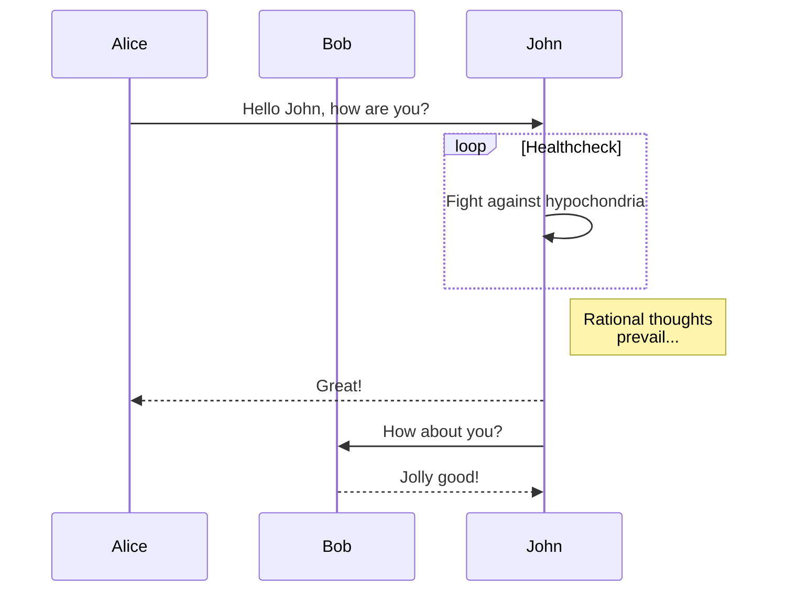
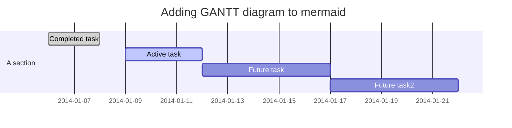
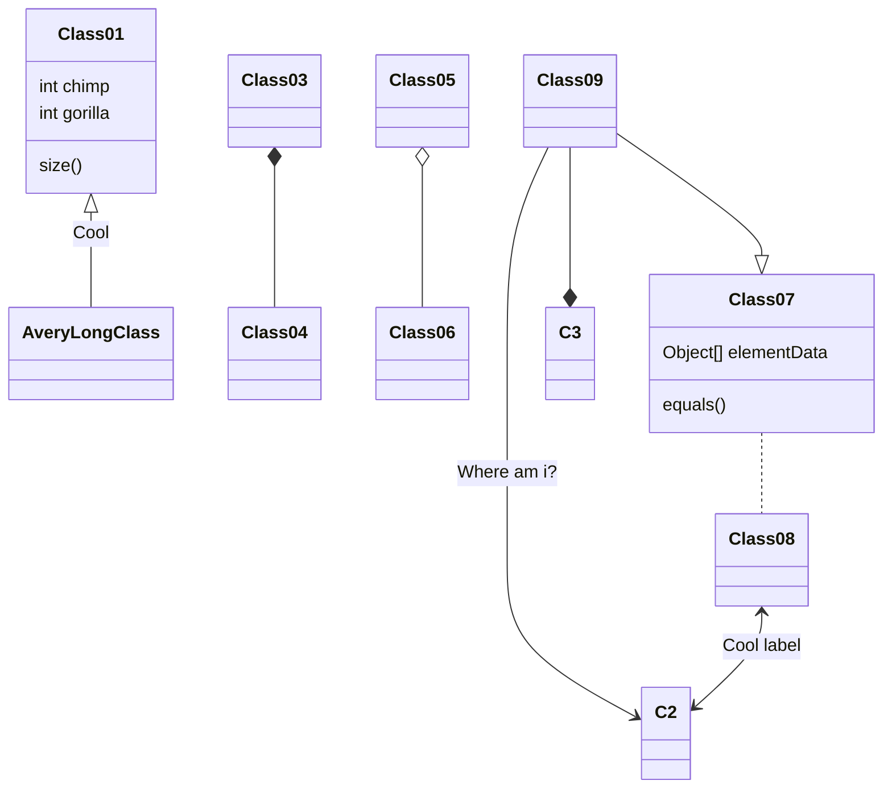

> 欢迎体验 [Fluid](https://github.com/fluid-dev/hexo-theme-fluid) ，这是一款 Material Design 风格的 Hexo
> 主题，以简约的设计帮助你专注于写作，本篇文章可预览主题的样式及功能。

   

<!-- more -->

# Heading 1

## Heading 2

### Heading 3

#### Heading 4

##### Heading 5

###### Heading 6

This is an H1
=============

This is an H2
-------------

---

文章大部分使用的是 github-markdown 样式，并加入了一些 Material 风格。
上标：X<sub>2</sub>，下标：O<sup>2</sup>

> 引用：如果想要插入空白换行`即<br />标签`
> ，在插入处先键入两个以上的空格然后回车即可，[普通链接带标题](http://localhost/ "普通链接带标题")。
>

## 表格

| Left |  Center   |                   Right |
|:-----|:---------:|------------------------:|
| 删除线  |  ~~删除线~~  | <s>删除线（开启识别HTML标签时）</s> |
| 斜体字  |   *斜体字*   |                   _斜体字_ |
| 粗体   |  **粗体**   |                  __粗体__ |
| 粗斜体  | ***粗斜体*** |               ___粗斜体___ |

## 列表

### 有序列表

Fluid 相较于其他主题的优势：

1. 设计遵循简洁至上，同时具有轻快的体验，和优雅的颜值；
2. 提供大量定制化配置项，使每个用户使用该主题都能具有独特的样式；
3. 响应式页面，适配手机、平板等设备；

### 无序列表

Fluid 功能特性：

- 无比详实的[用户文档](https://hexo.fluid-dev.com/docs/)
- 页面组件懒加载
- 多种代码高亮方案
- 多语言配置
- 内置多款评论插件
- 内置网页访问统计
- 内置文章本地搜索
- 支持暗色模式
- 支持脚注语法
- 支持 LaTeX 数学公式
- 支持 mermaid 流程图

+ [X]  列表一
+ [ ]  列表二

## 代码

执行命令：`npm install marked`

```javascript
function test() {
    console.log("Hello world!");
}

var testBox = box();
testBox.add("jQuery").remove("jQuery");
```

```html
<!DOCTYPE html>
<html>
<head>
    <mate charest="utf-8"/>
    <title>Hello world!</title>
</head>
<body>
<h1>Hello world!</h1>
</body>
</html>
```

```shell
ls /
cat /proc/mounts
cat /proc/1/maps
apt-get update
apt-get install tcpdump
tcpdump
apt-get install lsof
lsof
```

```css
body {
    background-color: burlywood;
}

.black-background-5 {
    background-color: rgba(0, 0, 0, 0.5);
    border-color: rgba(0, 0, 0, 0.5);
}
```

```go
func main(){
    fmt.Println("go")
}
```

```java
public void main(String[] args){
    System.out.println("Hello World");
}
```

```json
{
  "url": "https://i.loli.net/2018/08/21/5b7bb5dd4f0df.png",
  "description": "wide image",
  "type": "wide"
}
```

```markdown
# Heading 1

[普通链接带标题](http://localhost/ "普通链接带标题")

执行命令：`npm install marked`
```

```sql
SELECT COUNT(*) AS cpt, MAX(t.pos) AS max_pos
FROM `my_table`
LEFT JOIN `other_table` AS t
WHERE `somecol` IS NOT NULL
ORDER BY t.other_col DESC
```

```yaml
product: High Heeled "Ruby" Slippers
description: "Putting on these \"slippers\" is easy."
address:
  city: East Centerville
  street: !!str |
    123 Tornado Alley
    Suite 16
```

## 图片


## LaTex

基于 MathJax 引擎：

$$
\Gamma _ { \epsilon } ( x ) = [ 1- e ^ { - 2\pi \epsilon } ] ^ { 1- x } \prod _ { n = 0} ^ { \infty } \frac { 1-
\operatorname{exp} ( - 2\pi \epsilon ( n + 1) ) } { 1- \operatorname{exp} ( - 2\pi \epsilon ( x + n ) ) }
$$

$$
\left( \begin{array} c t ^ { \prime } \\ x ^ { \prime } \\ y ^ { \prime } \\ z ^ { \prime } \end{array} \right) = \left(
\begin{array} { c c c c } { \gamma } & { - \gamma \beta } & { 0 } & { 0 } \\ { - \gamma \beta } & { \gamma } & { 0 } & {
0 } \\ { 0 } & { 0 } & { 1 } & { 0 } \\ { 0 } & { 0 } & { 0 } & { 1 } \end{array} \right) \left( \begin{array} c t \\
x \\ y \\ z \end{array} \right)
$$

$$
6 \mathrm { CO } _ { 2 } + 6 \mathrm { H } _ { 2 } \mathrm { O } \rightarrow \mathrm { C } _ { 6 } \mathrm { H } _ {
12 } \mathrm { O } _ { 6 } + 6 \mathrm { O } _ { 2 }
$$

## 流程图

基于 mermaid 语法：







## 内置 Tag 插件

内置了一些 Tag 插件，用于实现 Markdown
不容易生成的样式，具体使用方式请见 [用户指南](https://hexo.fluid-dev.com/docs/guide/#tag-%E6%8F%92%E4%BB%B6)。

### 便签


这里可以写文字 或者 `markdown`



这里可以写文字 或者 `markdown`



这里可以写文字 或者 `markdown`


### 行内标签

  

### 勾选框




### 按钮



### 折叠块

折叠块报错

### 组图






### 脚注

以下是脚注演示[^1]：

如果你有 Fluid 主题或 Hexo 博客相关的文章，可以通过 Pull Request 方式投稿[^2]。

[^1]: 脚注演示

[^2]: 投稿具体详见[https://github.com/fluid-dev/hexo-fluid-blog](https://github.com/fluid-dev/hexo-fluid-blog)